# Unified Agent Kit Architecture

> Comprehensive AI Agent Capability Expansion Toolkit

---

## 📋 Overview

Unified Agent Kit is a modular system consisting of:

- **39 Specialist Agents** - Role-based AI personas
- **55 Skills** - Domain-specific knowledge modules
- **21 Workflows** - Slash command procedures
- **1 MCP Server** - `skill-server` Go binary (skills_load, skills_list, skills_search)
- **Core Infrastructure** - Bus, Router, Telemetry, Dashboard, **Resilience Chain**
- **Autonomous SRE** - Incident Watcher, War Room Manager
- **Intelligence Layer** - Council of Sages (Multi-agent Consensus), Global Brain

---

## 🏗️ Directory Structure

```plaintext
.agent/
├── ARCHITECTURE.md          # This file
├── KNOWLEDGE.md             # Global Rules, Context, and Orchestration Standards
├── agents/                  # Specialist Agents profiles (.md) — with profile: frontmatter
├── skills/                  # Skills (Domain-specific knowledge modules)
├── workflows/               # Slash Commands for Unified Agent (+ Local triggers)
├── rules/                   # Global Rules (GEMINI.md)
├── scripts/                 # Master Validation Scripts
│   ├── lib/                 # Core Infrastructure Libraries
│   │   ├── paths.py         # Dynamic path resolution
│   │   ├── common.py        # Atomic JSON, logging, and shared utilities
│   │   └── resilience.py    # Self-healing and error handling logic
│   ├── status_report.py     # Workspace Health Dashboard
│   ├── drift_detector.py    # Documentation vs Code sync
│   ├── guardrail_monitor.py # Safety and budget enforcement
│   ├── bus_manager.py       # Context Bus (DTO) management
│   └── visualize_deps.py    # Automated Mermaid dependency visualization
└── skill-server/            # Go MCP binary (skills_load, skills_list, skills_search)
    ├── main.go
    ├── go.mod
    ├── Makefile
    ├── skill-server.sh      # Platform launcher (auto-detects OS/ARCH)
    └── bin/                 # Pre-built binaries (linux-amd64, linux-arm64)

### 📊 Dependency Map

```mermaid
graph TD
  adr_generator --> argparse
  agent_skill_auditor --> lib
  analyze_efficiency --> collections
  arbitrator --> bus_manager
  arbitrator --> lib
  auto_preview --> argparse
  auto_preview --> signal
  autonomous_fuzzer --> random
  autonomous_reviewer_cron --> drift_detector
  autonomous_reviewer_cron --> lib
  autonomous_reviewer_cron --> status_report
  batch_runner --> argparse
  bus_debugger --> lib
  bus_manager --> argparse
  bus_manager --> lib
  bus_manager --> typing
  business_dashboard --> rich
  chaos_monkey --> lib
  chaos_monkey --> random
  checklist --> argparse
  checklist --> doc_healer
  checklist --> lib
  checklist --> prompt_optimizer
  checklist --> status_report
  checklist --> task_tracer
  checklist --> typing
  checklist --> visualize_deps
  conflict_resolver --> collections
  conflict_resolver --> lib
  context_autofill --> lib
  discovery_brain_sync --> lib
  discovery_brain_sync --> semantic_brain_engine
  distill_context --> argparse
  doc_healer --> drift_detector
  doc_healer --> lib
  drift_detector --> argparse
  experience_distiller --> lib
  experience_distiller --> semantic_brain_engine
  generate_adr --> lib
  grafana_manager --> argparse
  grafana_manager --> resilience
  grafana_manager --> typing
  guardrail_monitor --> fnmatch
  guardrail_monitor --> lib
  incident_watcher --> bus_manager
  incident_watcher --> lib
  install_hooks --> lib
  install_hooks --> shutil
  intent_validator --> lib
  knowledge_synergy --> argparse
  knowledge_synergy --> lib
  main --> filepath
  main --> mcp
  main --> server
  main --> skills
  metrics_dashboard --> rich
  model_router --> argparse
  post_mortem_runner --> lib
  pr_audit --> lib
  pre_commit_review --> conflict_resolver
  pre_commit_review --> lib
  pre_commit_review --> status_report
  pre_commit_review --> task_tracer
  prompt_optimizer --> collections
  prompt_optimizer --> lib
  quality_tracker --> argparse
  quality_tracker --> collections
  quality_tracker --> urllib
  rollback_task --> argparse
  rollback_task --> lib
  sandbox_runner --> ast
  sandbox_runner --> tempfile
  security_scan --> argparse
  security_scan --> lib
  self_healer --> traceback
  semantic_brain_engine --> lib
  semantic_brain_engine --> typing
  semantic_experience --> lib
  session_manager --> argparse
  session_manager --> typing
  skill_factory --> argparse
  skill_factory --> lib
  skill_versioning --> argparse
  status_report --> drift_detector
  status_report --> lib
  sync_claude_agents --> argparse
  sync_claude_agents --> visualize_deps
  task_helper --> argparse
  task_miner --> argparse
  task_miner --> lib
  task_tracer --> lib
  verify_all --> argparse
  verify_all --> typing
  visualize_deps --> lib
  war_room_manager --> bus_manager
  war_room_manager --> lib
```

<!-- DEPENDENCY_GRAPH_START -->

<!-- DEPENDENCY_GRAPH_END -->

# Prompt Library Hub Features (Repository Root)
├── prompt/patterns/         # Execution Methodologies (featureforge, bugcatcher, reviewer)
├── tasks/                   # Active Agent Task Queue
├── .github/distribution.yml # CRON Task Distribution Map
└── .github/profiles.yml     # Distribution Profiles (go-service, web-app, data-platform, mobile, game)

## 🛠️ Workspace Management & Hygiene
- `python3 .agent/scripts/status_report.py` - Unified Dashboard (Tech + Business)
- `python3 .agent/scripts/task_helper.py` - Task card generator for `tasks/`
- `python3 .agent/scripts/drift_detector.py` - Wiki vs Code drift detection
- `python3 .agent/scripts/metrics_dashboard.py` - Real-time agent telemetry
- `python3 .agent/scripts/business_dashboard.py` - Story card progress tracking
- `python3 .agent/skills/lint-and-validate/scripts/lint_runner.py` - Janitor & Linter
```

---

## 🤖 Agents (36)

Specialist AI personas for different domains.

| Agent                    | Focus                      | Skills Used                                                       |
| ------------------------ | -------------------------- | ----------------------------------------------------------------- |
| `orchestrator`           | Multi-agent coordination   | parallel-agents, behavioral-modes, intelligent-routing            |
| `analyst`                | BMAD lifecycle driver      | bmad-lifecycle, plan-writing, brainstorming, architecture         |
| `project-planner`        | Discovery, task planning   | brainstorming, plan-writing, architecture                         |
| `frontend-specialist`    | Web UI/UX                  | frontend-design, nextjs-react-expert, tailwind-patterns, i18n-localization |
| `backend-specialist`     | API, business logic        | api-patterns, nodejs-best-practices, database-design              |
| `database-architect`     | Schema, SQL                | database-design                                                   |
| `mobile-developer`       | iOS, Android, RN           | mobile-design, i18n-localization                                  |
| `game-developer`         | Game logic, mechanics      | game-development                                                  |
| `go-specialist`          | Go, gRPC, Concurrency, Perf | go-patterns, godoc-patterns, api-patterns, architecture          |
| `crypto-specialist`      | TON, DEX, Exchange, Trading | api-patterns, architecture                                       |
| `crypto-go-architect`    | Go + Crypto system design   | go-patterns, api-patterns, architecture, brainstorming           |
| `devops-engineer`        | CI/CD, Docker              | deployment-procedures, server-management                          |
| `security-auditor`       | Security compliance        | vulnerability-scanner, red-team-tactics                           |
| `penetration-tester`     | Offensive security         | red-team-tactics                                                  |
| `test-engineer`          | Testing strategies         | testing-patterns, tdd-workflow, webapp-testing                    |
| `debugger`               | Root cause analysis        | systematic-debugging                                              |
| `red-team`               | Adversarial Auditor        | red-team-tactics, vulnerability-scanner                           |
| `performance-optimizer`  | Speed, Web Vitals          | performance-profiling                                             |
| `seo-specialist`         | Ranking, visibility        | seo-fundamentals, geo-fundamentals                                |
| `documentation-writer`   | Manuals, docs              | documentation-templates, i18n-localization                        |
| `product-manager`        | Requirements, user stories | plan-writing, brainstorming                                       |
| `product-owner`          | Strategy, backlog, MVP     | plan-writing, brainstorming                                       |
| `qa-automation-engineer` | E2E testing, CI pipelines  | webapp-testing, testing-patterns                                  |
| `code-archaeologist`     | Legacy code, refactoring   | clean-code, code-review-checklist                                 |
| `rest-api-designer`      | REST / OpenAPI design      | api-patterns, typescript-expert, documentation-templates          |
| `grpc-architect`         | gRPC / Protobuf design     | go-patterns, api-patterns, architecture                           |
| `explorer-agent`         | Codebase analysis          | -                                                                 |
| `reviewer`               | Automated code auditing    | code-review-checklist, vulnerability-scanner, systematic-debugging |
| `git-master`             | Git internals & recovery   | git-master, bash-linux, systematic-debugging, clean-code           |
| `k8s-engineer`           | Kubernetes platform        | k8s-patterns, deployment-procedures, server-management, bash-linux |
| `ai-engineer`            | AI / LLM systems           | llm-patterns, python-patterns, api-patterns, systematic-debugging  |
| `wiki-architect`         | Knowledge architecture     | wiki-writing, documentation-templates, brainstorming               |
| `data-engineer`          | Data pipelines & analytics | data-patterns, database-design, python-patterns, bash-linux        |
| `sre-engineer`           | Reliability engineering    | observability-patterns, k8s-patterns, deployment-procedures       |
| `cloud-engineer`         | Multi-cloud infrastructure | cloud-patterns, terraform-patterns, deployment-procedures         |
| `visual-designer`      | UI/UX aesthetics          | frontend-design, web-design-guidelines                            |
| `release-manager`     | Versioning & SemVer       | git-master, testing-patterns, lint-and-validate                   |

---

## 🧩 Skills (53)

Modular knowledge domains that agents can load on-demand. based on task context.

### Frontend & UI

| Skill                   | Description                                                           |
| ----------------------- | --------------------------------------------------------------------- |
| `nextjs-react-expert`   | React & Next.js performance optimization (Vercel - 57 rules)          |
| `web-design-guidelines` | Web UI audit - 100+ rules for accessibility, UX, performance (Vercel) |
| `tailwind-patterns`     | Tailwind CSS v4 utilities                                             |
| `frontend-design`       | UI/UX patterns, design systems                                        |
| `ui-ux-pro-max`         | 50 styles, 21 palettes, 50 fonts                                      |

### Backend & API

| Skill                   | Description                                                 |
| ----------------------- | ----------------------------------------------------------- |
| `api-patterns`          | REST, GraphQL, tRPC                                         |
| `nodejs-best-practices` | Node.js async, modules                                      |
| `python-patterns`       | Python standards, FastAPI                                   |
| `go-patterns`           | Go frameworks, gRPC, buf                                    |
| `rust-pro`              | Rust patterns, systems                                      |
| `typescript-expert`     | Strict-mode TS, OpenAPI→TS generation, SDK type design, Zod |

### Database

| Skill             | Description                 |
| ----------------- | --------------------------- |
| `database-design` | Schema design, optimization |

### Cloud & Infrastructure

| Skill                    | Description                                                           |
| ------------------------ | --------------------------------------------------------------------- |
| `deployment-procedures`  | CI/CD, deploy workflows                                               |
| `server-management`      | Infrastructure management                                             |
| `terraform-patterns`     | HCL modules, state management, plan/apply safety, checkov, terratest  |
| `observability-patterns` | OTel, Prometheus, Grafana, Loki, Jaeger, SLO/SLI, Alertmanager       |

### Testing & Quality

| Skill                   | Description              |
| ----------------------- | ------------------------ |
| `testing-patterns`      | Jest, Vitest, strategies |
| `webapp-testing`        | E2E, Playwright          |
| `tdd-workflow`          | Test-driven development  |
| `code-review-checklist` | Code review standards    |
| `lint-and-validate`     | Linting, validation      |

### Security

| Skill                   | Description              |
| ----------------------- | ------------------------ |
| `vulnerability-scanner` | Security auditing, OWASP |
| `red-team-tactics`      | Offensive security       |

### Architecture & Planning

| Skill           | Description                |
| --------------- | -------------------------- |
| `app-builder`   | Full-stack app scaffolding |
| `architecture`  | System design patterns     |
| `plan-writing`  | Task planning, breakdown   |
| `brainstorming` | Socratic questioning       |

### Mobile

| Skill           | Description           |
| --------------- | --------------------- |
| `mobile-design` | Mobile UI/UX patterns |

### Game Development

| Skill              | Description           |
| ------------------ | --------------------- |
| `game-development` | Game logic, mechanics |

### SEO & Growth

| Skill              | Description                   |
| ------------------ | ----------------------------- |
| `seo-fundamentals` | SEO, E-E-A-T, Core Web Vitals |
| `geo-fundamentals` | GenAI optimization            |

### Shell/CLI

| Skill                | Description               |
| -------------------- | ------------------------- |
| `bash-linux`         | Linux commands, scripting |
| `powershell-windows` | Windows PowerShell        |

### Code Quality & Refactoring

| Skill                    | Description                              |
| ------------------------ | ---------------------------------------- |
| `clean-code`             | Coding standards (Global)                |
| `refactoring-patterns`   | Code smell detection, safe transforms    |
| `code-review-checklist`  | Code review standards                    |

### Agent & Lifecycle

| Skill                     | Description                       |
| ------------------------- | --------------------------------- |
| `behavioral-modes`        | Agent personas                    |
| `parallel-agents`         | Multi-agent patterns              |
| `mcp-builder`             | Model Context Protocol            |
| `documentation-templates` | Doc formats                       |
| `i18n-localization`       | Internationalization              |
| `performance-profiling`   | Web Vitals, optimization          |
| `systematic-debugging`    | Troubleshooting                   |
| `shared-context`         | Context Bus & DTO management      |
| `telemetry`              | Execution metrics & cost tracking |
| `bmad-lifecycle`          | BMAD phase knowledge & contracts  |
| `intelligent-routing`     | Task routing & agent coordination |

---

## 🔄 Workflows (21)

Slash command procedures. Invoke with `/command`.

| Command               | Description                            |
| --------------------- | -------------------------------------- |
| `/brainstorm`         | Socratic discovery                     |
| `/create`             | Create new features                    |
| `/debug`              | Debug issues                           |
| `/deploy`             | Deploy application                     |
| `/enhance`            | Improve existing code                  |
| `/orchestrate`        | Multi-agent coordination               |
| `/plan`               | Task breakdown                         |
| `/preview`            | Preview changes                        |
| `/status`             | Check project status                   |
| `/test`               | Run tests                              |
| `/ui-ux-pro-max`      | Design with 50 styles                  |
| `/release`            | Production release cycle               |
| `/reviewer`           | Scan code, generate task queue         |
| `/discovery`          | BMAD Phase 1 — Socratic brief          |
| `/prd`                | BMAD Phase 2 — PRD from brief          |
| `/architecture-bmad`  | BMAD Phase 3 — Architecture + ADRs     |
| `/stories`            | BMAD Phase 4 — Story card batch        |
| `/sprint`             | BMAD Phase 5 — Sprint board            |
| `/close-sprint`       | BMAD — Close sprint, archive artifacts |

---

## 🎯 Skill Loading Protocol

```plaintext
User Request → Skill Description Match → Load SKILL.md
                                            ↓
                                    Read references/
                                            ↓
                                    Read scripts/
```

### Skill Structure

```plaintext
skill-name/
├── SKILL.md           # (Required) Metadata & instructions
├── scripts/           # (Optional) Python/Bash scripts
├── references/        # (Optional) Templates, docs
└── assets/            # (Optional) Images, logos
```

### Enhanced Skills (with scripts/references)

| Skill               | Files | Coverage                            |
| ------------------- | ----- | ----------------------------------- |
| `ui-ux-pro-max`     | 27    | 50 styles, 21 palettes, 50 fonts    |
| `app-builder`       | 20    | Full-stack scaffolding              |

---

## 📜 Scripts (23)

Master validation scripts that orchestrate skill-level scripts.

### Master Scripts

| Script                | Purpose                                 | When to Use              |
| --------------------- | --------------------------------------- | ------------------------ |
| `checklist.py`        | Priority-based validation (Core checks) | Development, pre-commit  |
| `verify_all.py`       | Comprehensive verification (All checks) | Pre-deployment, releases |
| `model_router.py`     | Dynamic task complexity routing (L1-L3) | Every subagent call      |
| `bus_manager.py`      | Context Bus administration (Push/Pull)  | Debugging, inspection    |
| `business_dashboard.py` | Feature-level progress tracking (Rich) | /status, sprint review   |
| `metrics_dashboard.py` | Technical observability (CLI Monitor)   | Monitoring               |
| `drift_detector.py`   | Documentation lag detection             | /status, /release        |
| `analyze_efficiency.py` | Performance & Cost (Token usage)       | Monthly audit            |
| `distill_context.py`  | Long-context optimization (RAG/Extract) | Shared Context Bus       |
| `batch_runner.py`     | Fan-out / Fan-in parallel execution    | Multi-agent tasks        |
| `experience_distiller.py` | Lesson learned archiving (30 days), `--auto-export` to global brain | Maintenance, post-merge  |
| `autonomous_reviewer_cron.py` | Daily codebase audit — drift, infra, roadmap gaps → task cards | self-driving-ops.yml (daily) |
| `guardrail_monitor.py` | Budget & Token safety watchdog         | Runtime monitoring       |
| `post_mortem_runner.py` | Failure analysis & Lesson generation   | After task failure       |
| `doc_healer.py`      | Self-healing Documentation        | after code changes       |
| `knowledge_synergy.py` | Cross-project knowledge sync    | Post-Mortem, ADR export  |
| `incident_watcher.py`  | Autonomous failure detection    | Runtime, CI/CD           |
| `war_room_manager.py`  | Multi-agent incident resolution | After incident           |
| `arbitrator.py`        | Multi-agent consensus manager   | Architecture decisions   |
| `resource_forecaster.py` | Token & time budget prediction | Phase 22/23 Gateway Audit |
| `hidden_war_room.py`   | 4-participant agent debate      | Strategic thinking & Veto |
| `truth_validator.py`   | Cross-source truth check        | Requirement validation    |
| `personality_adapter.py` | Style & DNA adaptation         | User stylistic alignment  |
| `requirement_expander.py` | Hybrid knowledge expansion     | /prd, /architecture      |
| `auto_adr_drafter.py`  | Autonomous ADR drafting        | Phase 3 Architecture     |
| `browser_resilience.py` | Browser connectivity manager     | Every web/browser task   |
| `output_bridge.py`     | Agent output validator & Red-Team Gate | Every final response     |
| `model_router.py`     | Unified Provider Router (Gemini/Claude) | Every subagent call      |
| `self_healer.py`       | Autonomous Script Repair Wrapper       | Tool execution           |
| `skill_discovery.py`   | JIT Skill Acquisition (URL Fetcher)    | Knowledge expansion      |
| `sandbox_runner.py`    | Safe Code Sandbox (AST + Isolation)    | Untrusted code execution |
| `predictive_watcher.py` | Predictive DevOps (Auto-ADR)          | Post-session maintenance |
| `obsidian_sync.py`    | Obsidian Wiki-to-Code Bridge          | Every final response     |
| `model_validator.py`  | Mental Model Architecture Validator   | Every final response     |
| `governance_gate.py`  | Wiki-First Enforcement Sentinel       | Every final response     |
| `knowledge_miner.py`  | Retroactive Knowledge Archeologist    | Maintenance              |
| `walkthrough_assembler.py` | Auto-documentation assembler   | Maintenance              |
| `task_sync.py`        | Task status synchronizer        | Maintenance              |

### Usage

```bash
# Quick validation during development
python .agent/scripts/checklist.py .

# Full verification before deployment
python .agent/scripts/verify_all.py . --url http://localhost:3000
```

### What They Check

**checklist.py** (Core checks):

- Security (vulnerabilities, secrets)
- Code Quality (lint, types)
- Schema Validation
- Test Suite
- UX Audit
- SEO Check

**verify_all.py** (Full suite):

- Everything in checklist.py PLUS:
- Lighthouse (Core Web Vitals)
- Playwright E2E
- Bundle Analysis
- Mobile Audit
- i18n Check

For details, see [scripts/README.md](scripts/README.md)

---

## 🛠️ CLI Tool Reference

The following tools are available in `.agent/scripts/` for maintenance and safety:

### `checklist.py`
Master validation runner.
- `python3 .agent/scripts/checklist.py .` - Run all core checks.
- `--fix` - Automatically fix simple configuration and directory issues.
- `--url <URL>` - Include performance and E2E checks.

### `guardrail_monitor.py`
Safety and budget watchdog.
- `--check-cmd "<command>"` - Validate a command against block/warn lists. Handles pipes, subshells, and detects secret leaks.
- `--check-file "<path>"` - Check if a file is protected.

### `experience_distiller.py`
Learning and knowledge maintenance.
- `python3 .agent/scripts/experience_distiller.py` - Archive lessons older than 30 days.
- `--skill <name>` - Filter and display lessons for a specific skill (searches active and archives).
- `--list-skills` - List all unique skill tags in the knowledge base.

### `bus_manager.py`
Context Bus administration.
- `push --id <ID> --type <TYPE> --author <NAME> --content '<JSON>'` - Push data to the shared bus. Alerts if telemetry exceeds budget.
- `wait --id <ID> --timeout <sec>` - Wait for a specific object to appear.
- `list`, `peek`, `delete`, `clear` - Manage bus objects.

### `visualize_deps.py`
Dependency Graph Generator.
- `python3 .agent/scripts/visualize_deps.py` - Scans imports and updates the Mermaid diagram in `ARCHITECTURE.md`.

### `status_report.py`
Workspace Health Dashboard.
- `python3 .agent/scripts/status_report.py` - Shows the Health Score (0-100%) based on drift, logs, security, and tests.

### `generate_adr.py`
Architecture Decision Record Generator.
- `python3 .agent/scripts/generate_adr.py "<Title>" "<Context>" "<Decision>"` - Creates a new ADR in `wiki/decisions/`.

### `post_mortem_runner.py`
Failure Analysis Tool.
- `python3 .agent/scripts/post_mortem_runner.py` - Analyzes recent logs and suggests a lesson learned.

### `pre_commit_review.py`
Git Hook Reviewer.
- `python3 .agent/scripts/pre_commit_review.py` - Checks staged diffs against historical lessons in `LESSONS_LEARNED.md`.

### `rollback_task.py`
Task & State Undo.
- `python3 .agent/scripts/rollback_task.py [--author <name>]` - Reverts git changes and cleans up the context bus.

### `test_factory.py`
Unit Test Generator.
- `python3 .agent/scripts/test_factory.py <target_file>` - Generates basic test files for Python and Go.

### `vulnerability_patcher.py`
Security Auto-patch Helper.
- `python3 .agent/scripts/vulnerability_patcher.py <type> <file> <context>` - Formats a secure fix request for an agent.

### `bus_debugger.py`
Interactive Bus Inspector.
- `python3 .agent/scripts/bus_debugger.py` - Interactive shell to list and peek at bus objects.

### `task_tracer.py`
Git-to-Task Traceability.
- `python3 .agent/scripts/task_tracer.py` - Links staged changes to active cards in `tasks/`. Triggered by `pre-commit`.

### `prompt_optimizer.py`
Cost & Prompt Efficiency.
- `python3 .agent/scripts/prompt_optimizer.py` - Analyzes telemetry and suggests token reductions.

### `conflict_resolver.py`
Bus Arbitration.
- `python3 .agent/scripts/conflict_resolver.py` - Detects ID collisions and state conflicts.

### `semantic_experience.py`
Contextual Knowledge Search.
- `python3 .agent/scripts/semantic_experience.py <query>` - Searches LESSONS_LEARNED.md using keyword overlap.

### `doc_healer.py`
Self-healing Documentation.
- `python3 .agent/scripts/doc_healer.py` - Analyzes code and updates ARCHITECTURE.md for new files.

---

## 🤖 Claude Code Integration

The `.agent/` folder is the **source of truth** for both Unified Agent (Gemini) and Claude Code.
A thin adapter layer in `.claude/` makes the same agents and skills available to Claude Code.

### How It Works

```plaintext
.agent/agents/*.md     → .claude/agents/*.md         (specialist subagents, @-invokable)
.agent/workflows/*.md  → .claude/agents/wf-*.md      (workflow subagents,   @-invokable)
.agent/workflows/*.md  → .claude/commands/*.md        (slash commands,       /name invokable)
```

`$ARGUMENTS` is preserved verbatim in commands — identical syntax for both Unified Agent and Claude Code.

### Files Added for Claude Code

- `CLAUDE.md` (repo root) — Claude Code entry point, @includes KNOWLEDGE.md + ARCHITECTURE.md
- `.agent/templates/CLAUDE.md` — Template provisioned to target repos on first CI deploy
- `.claude/settings.json` — MCP server config + `"agent": "orchestrator"` for auto-routing
- `~/.claude/.mcp.json` — User-level MCP config (skill-server at absolute path)
- `.claude/agents/*.md` — 31 specialist agents + 18 workflow agents (generated, @-invokable)
- `.claude/commands/*.md` — 18 slash commands `/name` (generated, same source as workflows)
- `.agent/scripts/sync_claude_agents.py` — Generator script (`--profile`, `--agent`, `--dry-run`)
- `.agent/skill-server/` — Go MCP binary source + pre-built linux binaries

### Skill Loading: Unified Agent vs Claude Code

- **Unified Agent**: reads `skills:` frontmatter → auto-loads SKILL.md on demand
- **Claude Code (Variant A)**: dynamic loading — generated agents get a `> **Skills** — read these files` pointer block; no inline embedding. Eliminates duplication and the 100-line truncation limit.
- **skill-server MCP** (Variant C): Go binary exposes `skills_load`, `skills_list`, `skills_search` tools via stdio JSON-RPC. Configured in `.claude/settings.json` (project) and `~/.claude/.mcp.json` (user).

### Slash Commands vs Subagents in Claude Code

Both are generated from the same `.agent/workflows/` source. Use the right one for the job:

- `/debug error message` — slash command, runs inline in current chat
- `@wf-debug` — subagent, used by orchestrator to delegate work programmatically

### Regenerating After Changes

```bash
# After editing .agent/agents/, .agent/skills/, or .agent/workflows/:
python3 .agent/scripts/sync_claude_agents.py

# Agents only (skip commands):
python3 .agent/scripts/sync_claude_agents.py --no-commands

# Single agent only:
python3 .agent/scripts/sync_claude_agents.py --agent debugger

# Preview without writing:
python3 .agent/scripts/sync_claude_agents.py --dry-run

# Distribution profile — only agents relevant for the target repo type:
python3 .agent/scripts/sync_claude_agents.py --profile go-service
python3 .agent/scripts/sync_claude_agents.py --profile web-app
python3 .agent/scripts/sync_claude_agents.py --profile data-platform
python3 .agent/scripts/sync_claude_agents.py --profile mobile
```

### CI Distribution

`distribute-agentic-kit.yml` runs `sync_claude_agents.py` (optionally with `--profile`) before rsync and distributes:

- `.agent/` — Unified Agent Kit (unchanged)
- `.claude/agents/` — Claude Code subagents (generated, filtered by profile if set)
- `.claude/commands/` — Claude Code slash commands (generated)
- `.agent/skill-server/bin/` — Pre-built Go binaries (linux-amd64, linux-arm64)
- `CLAUDE.md` — first-time provisioning only (target repos own their copy after that)

Triggers on changes to `.agent/**` or `.claude/**`. Binaries are built by `build-skill-server.yml` and committed to the repo, so distribution requires no Go toolchain in target repos.

**Profile-based distribution** — add `--profile <name>` to the rsync step to exclude domain-irrelevant agents. Profiles defined in `.github/profiles.yml`.

### Naming Conventions in `.claude/`

- `.claude/agents/` — no prefix: specialist (`debugger.md`); `wf-` prefix: workflow (`wf-debug.md`)
- `.claude/commands/` — filename = command name (`debug.md` → `/debug`)

---

## 📊 Statistics

| Metric              | Value                                           |
| ------------------- | ----------------------------------------------- |
| **Total Agents**    | 39                                              |
| **Total Skills**    | 55                                              |
| **Total Workflows** | 21                                              |
| **Total Scripts**   | 24                                              |
| **Total Patterns**  | 10 (5 original + 5 BMAD)                        |
| **MCP Servers**     | 1 (`skill-server` Go binary — stdio transport)  |
| **Coverage**        | ~95% web/mobile/backend/infra development       |

---

## 🔗 Quick Reference

### Central Orchestration (CRON & Tasks)

- **Queue**: Tasks sit in the `tasks/` directory of target repositories.
- **Rules**: Routing matrix and PR formats are defined in `.agent/KNOWLEDGE.md`.
- **Producer**: `prompt/patterns/reviewer.md` scans code and writes to `tasks/` (scheduled via `distribution.yml`).
- **Consumer Methodologies**: `bugcatcher.md`, `featureforge.md`, `knowledge_updater.md`.

| Need               | Agent                    | Skills                                                   |
| ------------------ | ------------------------ | -------------------------------------------------------- |
| Web App            | `frontend-specialist`    | react-best-practices, frontend-design, tailwind-patterns |
| API / Backend      | `backend-specialist`     | api-patterns, nodejs-best-practices, database-design     |
| Go / Microservices | `go-specialist`          | go-patterns, godoc-patterns, api-patterns, architecture  |
| Crypto / TON / DEX | `crypto-specialist`      | api-patterns, architecture                               |
| Go + Crypto system | `crypto-go-architect`    | go-patterns, api-patterns, architecture, brainstorming   |
| Mobile             | `mobile-developer`       | mobile-design                                            |
| Game               | `game-developer`         | game-development                                         |
| Database           | `database-architect`     | database-design, prisma-expert                           |
| DevOps / CI/CD     | `devops-engineer`        | deployment-procedures, docker-expert                     |
| Kubernetes / K8s   | `k8s-engineer`           | k8s-patterns, deployment-procedures, terraform-patterns  |
| Observability/SRE  | `sre-engineer`           | observability-patterns, k8s-patterns                     |
| Git / Conflicts    | `git-master`             | git-master, bash-linux                                   |
| AI / LLM           | `ai-engineer`            | llm-patterns, python-patterns                            |
| Wiki / Knowledge   | `wiki-architect`         | wiki-writing, documentation-templates                    |
| Data Pipelines     | `data-engineer`          | data-patterns, database-design, python-patterns          |
| Security Audit     | `security-auditor`       | vulnerability-scanner, red-team-tactics                  |
| Pentesting         | `penetration-tester`     | red-team-tactics                                         |
| Testing            | `test-engineer`          | testing-patterns, tdd-workflow, webapp-testing           |
| E2E / QA           | `qa-automation-engineer` | webapp-testing, testing-patterns                         |
| Debug              | `debugger`               | systematic-debugging                                     |
| Performance        | `performance-optimizer`  | performance-profiling                                    |
| SEO / GEO          | `seo-specialist`         | seo-fundamentals, geo-fundamentals                       |
| Documentation      | `documentation-writer`   | documentation-templates                                  |
| Legacy / Refactor  | `code-archaeologist`     | clean-code, code-review-checklist                        |
| Codebase Explore   | `explorer-agent`         | —                                                        |
| Code Review        | `reviewer`               | —                                                        |
| Multi-agent        | `orchestrator`           | parallel-agents, behavioral-modes                        |
| Requirements / UX  | `product-manager`        | plan-writing, brainstorming                              |
| Strategy / Backlog | `product-owner`          | plan-writing, brainstorming                              |
| Plan               | `project-planner`        | brainstorming, plan-writing, architecture                |
| BMAD               | `analyst`                | bmad-lifecycle, plan-writing, brainstorming, architecture |

---

## 🔄 BMAD Lifecycle (Product Development)

BMAD layers structured product lifecycle on top of the existing agent system. Each phase produces a `wiki/` artifact consumed by the next, with explicit approval gates.

### Phase Flow

```
/discovery → wiki/BRIEF.md (approve)
    ↓
/prd → wiki/PRD.md (approve)
    ↓
/architecture-bmad → wiki/ARCHITECTURE.md (approve)
    ↓
/stories → tasks/[STORY]-*.md (batch of atomic cards)
    ↓
/sprint → wiki/sprints/sprint-NN.md
    ↓
Jules automation: full_cycle pattern → 1 story → 1 PR
```

### BMAD New Files

| File | Purpose |
|------|---------|
| `.agent/agents/analyst.md` | BMAD lifecycle driver — Discovery through Sprint |
| `.agent/skills/bmad-lifecycle/SKILL.md` | Phase knowledge, artifact contracts, story card format |
| `.agent/workflows/discovery.md` | `/discovery` — Phase 1 slash command |
| `.agent/workflows/prd.md` | `/prd` — Phase 2 slash command |
| `.agent/workflows/architecture-bmad.md` | `/architecture-bmad` — Phase 3 slash command |
| `.agent/workflows/stories.md` | `/stories` — Phase 4 slash command |
| `.agent/workflows/sprint.md` | `/sprint` — Phase 5 slash command |
| `.agent/wiki-templates/PRD.md` | PRD artifact template (distributed to all repos) |
| `.agent/wiki-templates/ARCHITECTURE.md` | Architecture decision template |
| `.agent/wiki-templates/EPIC.md` | Epic grouping template |
| `.agent/wiki-templates/STORY.md` | Story/task card template |
| `.agent/wiki-templates/DECISIONS.md` | ADR log template |
| `.agent/wiki-templates/GOTCHAS.md` | Codebase pitfalls template |
| `prompt/patterns/discovery.md` | Jules: PRD generation from brief |
| `prompt/patterns/story_writer.md` | Jules: story card batch generation |
| `prompt/patterns/sprint_planner.md` | Jules: sprint board generation |
| `prompt/patterns/sprint_closer.md` | Jules: auto-close sprint + archive artifacts |
| `prompt/patterns/full_cycle.md` | Jules: implement + test + debug loop + security → single PR |

### BMAD Automation Schedule (distribution.yml)

| Pattern | Agent | Schedule | Purpose |
|---------|-------|----------|---------|
| `discovery` | `analyst` | Mon 08:00 | Sync PRD from Brief |
| `story_writer` | `analyst` | Mon 09:00 | Seed new story cards |
| `sprint_planner` | `analyst` | Mon 10:00 | Update sprint board |
| `full_cycle` | `backend-specialist` | Daily 11:00 | Implement 1 story → 1 PR |
| `sprint_closer` | `analyst` | Daily 23:50 | Auto-close sprint when all tasks done |


## 🛡️ Autonomous SRE & Intelligence (Auto-SRE)

The kit implements a self-healing loop inspired by high-reliability systems.

### 1. The Reflex Loop (War Room)
- **Detection**: `incident_watcher.py` monitors all exit codes.
- **Elevation**: Failures are pushed to the Context Bus as `incident` objects.
- **Resolution**: `war_room_manager.py` invokes a triad of agents (Debugger, Test Engineer, Orchestrator) to generate a `proposed_fix`.
- **Git-Ops**: In user-less mode, the system creates a `fix/inc-ID` branch and commits verified fixes autonomously.

### 2. Council of Sages (Consensus)
Mandatory multi-agent review for architectural decisions.
- **Workflow**: Draft → Challenge (Red-Team) → Defense (Proposer) → Verdict (Arbitrator).
- **Enforcement**: ADRs without an `approved` verdict on the bus are blocked by the Pre-Commit Gate.

### 3. Global Knowledge Layer (Global Brain)
Knowledge shared across repositories and AI tools (Gemini, Claude Code).
- **Storage**: Neutral path `~/.agent_knowledge/` (configurable via `AGENT_GLOBAL_ROOT`).
- **Sync**: `knowledge_synergy.py` exports repository ADRs to the global lessons base.
- **Search**: `experience_distiller.py` performs multi-root search (Local + Global).

---

## 🧠 Cognitive Automation & Unified Provider Routing (Phase 2026)

The kit implements a provider-agnostic cognitive layer that bridges Antigravity (Gemini) and Cloud Core (Claude).

### 1. Unified Multi-Model Router
- **Logic**: Automatically detects the active environment (`AGENT_PROVIDER`) and maps task complexity (L1-L3) to the most cost-effective yet capable model.
- **Failover**: Implements cross-provider fallback (e.g., if Gemini is rate-limited, it routes to Claude).

### 2. Autonomous Self-Healing & JIT Skills
- **Self-Repair**: `self_healer.py` wraps critical script execution. If a failure is detected, it generates a "Repair DTO" in the Context Bus for the `@debugger` agent to fulfill.
- **JIT Acquisition**: `skill_discovery.py` allows agents to ingest external documentation on-the-fly, synthesizing new skills in `.agent/skills/temp/` without human intervention.

### 3. Safety Gate & AST Sandbox
- **Red-Team Gate**: Instrumented in `output_bridge.py`. Critical infrastructure or security changes are automatically audited by `security_scan.py` and `threat_modeler.py` before completion.
- **Safe Execution**: `sandbox_runner.py` uses AST static analysis to block dangerous code and executes in a restricted, temporary environment.

---

## 🆕 Recent Additions

| File | Description |
| --- | --- |
| `.agent/scripts/grafana_manager.py` | Grafana dashboard CRUD — create/update panels, datasources, alerts via REST API. |
| `.agent/scripts/incident_watcher.py` | Incident Watcher — monitors process exit codes and pushes failures to Context Bus. |
| `.agent/scripts/war_room_manager.py` | War Room Manager — orchestrates Debugger + Test-Engineer + Orchestrator triad for autonomous incident resolution. |
| `.agent/scripts/arbitrator.py` | Council of Sages judge — produces a `verdict` on architectural decisions from multi-agent debate. |
| `.agent/scripts/skill_factory.py` | Generates SKILL.md scaffolding for new skills with correct frontmatter and structure. |
| `.agent/scripts/task_miner.py` | Mines `wiki/ROADMAP.md` for untracked backlog items and converts them to `tasks/` cards. |
| `.agent/scripts/pr_audit.py` | Deep PR audit — runs security, drift, conflict, and quality checks on staged changes. |
| `.agent/scripts/chaos_monkey.py` | Deliberate fault injection for resilience testing (run on throwaway branches only). |
| `.agent/scripts/semantic_brain_engine.py` | TF-IDF semantic search engine over LESSONS_LEARNED and global knowledge base. |
| `.agent/scripts/agent_skill_auditor.py` | Ensures every agent has mandatory skills (clean-code) and valid SKILL.md metadata. |
| `.agent/scripts/ci_auto_fixer.py` | Auto-healing: detects failing CI jobs and proposes targeted fix commits. |
| `.agent/scripts/context_autofill.py` | Autonomous context investigator — pulls ADRs, lessons, and bus state before an agent starts. |
| `.agent/scripts/discovery_brain_sync.py` | Syncs discovery output to Semantic Brain for future semantic search queries. |
| `.agent/scripts/intent_validator.py` | Phase 18 gate — detects architectural conflicts before implementation begins. |
| `.agent/scripts/ambiguity_detector.py` | Socratic gate — identifies vague or ambiguous requirements before coding. |
| `.agent/scripts/impact_analyzer.py` | Estimates blast radius of a change across the codebase before execution. |
| `.agent/scripts/code_polisher.py` | Applies senior-level polish: removes dead code, enforces naming conventions, simplifies logic. |
| `.agent/scripts/failure_correlator.py` | Cross-references recent failures with LESSONS_LEARNED to detect repeated mistakes. |
| `.agent/scripts/threat_modeler.py` | STRIDE-based threat modeler — generates threat model for a given component or PR. |
| `.agent/scripts/resource_optimizer.py` | Economic audit — identifies high-token operations and suggests cheaper alternatives. |
| `.agent/scripts/ghost_prototyper.py` | Creates throwaway proof-of-concept branches to validate architectural hypotheses. |
| `.agent/scripts/autonomous_fuzzer.py` | Generates randomized edge-case inputs to stress-test functions and APIs. |
| `.agent/scripts/resource_forecaster.py` | Predicts token and wall-clock budget for a task before execution (Phase 23 gate). |
| `.agent/scripts/hidden_war_room.py` | 4-participant strategic debate: Optimist, Skeptic, Advocate, Arbitrator — for major decisions. |
| `.agent/scripts/truth_validator.py` | Cross-references Local Brain, global knowledge, and external sources for contradictions. |
| `.agent/scripts/personality_adapter.py` | Detects user stylistic DNA (Minimalism/Pragmatism) and adapts agent response style. |
| `.agent/scripts/requirement_expander.py` | Cascading knowledge retrieval — expands terse requirements into detailed specs with feedback loop. |
| `.agent/scripts/auto_adr_drafter.py` | Autonomous ADR drafting triggered by Phase 22/23 architectural decision gates. |
| `.agent/scripts/browser_resilience.py` | Browser connectivity manager for WSL/macOS — CDP, DNS gateway, headless fallback. |
| `.agent/scripts/output_bridge.py` | Mandatory Agent Output Gateway — validates 5-section report structure and syncs to bus. |
| `.agent/scripts/walkthrough_assembler.py` | Assembles session walkthrough log from task.md and bus events into wiki/archive. |
| `.agent/scripts/task_sync.py` | Synchronises task card status (open/in-progress/done) with Context Bus state. |
| `.agent/scripts/obsidian_validator.py` | Validates Obsidian-format wiki links and frontmatter before distribution to target repos. |
| `.agent/scripts/autonomous_reviewer_cron.py` | Daily codebase audit — drift, infra gaps, roadmap items → auto-creates task cards. |
| `.agent/scripts/security_scan.py` | OWASP static scanner — detects hardcoded secrets, dangerous patterns (eval, shell=True, weak hashes). |
| `.agent/scripts/session_manager.py` | Session Manager - Antigravity Kit |
