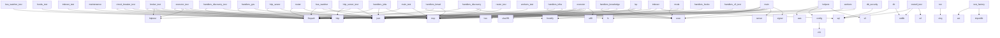

# Unified Agent Kit Architecture

> Comprehensive AI Agent Capability Expansion Toolkit

---

## 📋 Overview

Unified Agent Kit is a modular system consisting of:

- **69 Specialist Agents** - Role-based AI personas
- **182 Skills** - Domain-specific knowledge modules
- **27 Workflows** - Slash command procedures
- **1 MCP Server** - `skill-server` Go binary (skills_load, skills_list, skills_search)
- **Core Infrastructure** - Bus, Router, Telemetry, Dashboard, **Resilience Chain**
- **Autonomous SRE** - Incident Watcher, War Room Manager
- **Intelligence Layer** - Council of Sages (Multi-agent Consensus), Global Brain

---

## 🏗️ Directory Structure

```plaintext
.agent/
├── ARCHITECTURE.md          # This file
├── KNOWLEDGE.md             # Global Rules, Context, and Orchestration Standards
├── agents/                  # Specialist Agents profiles (.md)
├── skills/                  # Skills (Domain-specific knowledge modules)
├── workflows/               # Slash Commands for Unified Agent
├── rules/                   # Global Rules (Modular source)
├── scripts/                 # Master Validation Scripts
├── data/                    # Namespaced Persistent Data (Scoring, Metrics)
├── bus/                     # Context Bus (Ephemeral DTOs)
└── local-skill-server/      # Go MCP binary source (contains main.go, bus_watcher.go, LSP manager)
```

### 📊 Dependency Map
<!-- DEPENDENCY_GRAPH_START -->

```mermaid
graph TD
  broker_test --> filepath
  broker_test --> http
  broker_test --> httptest
  broker_test --> json
  broker_test --> mcp
  bus_watcher --> filepath
  bus_watcher --> fsnotify
  bus_watcher --> json
  bus_watcher_test --> filepath
  circuit_breaker_test --> filepath
  circuit_breaker_test --> http
  circuit_breaker_test --> json
  config --> v11
  db --> sql
  db --> stdlib
  db_security --> sql
  executor --> filepath
  executor --> hex
  executor --> http
  executor --> json
  executor --> mcp
  executor --> sha256
  executor --> utf8
  executor_test --> filepath
  executor_test --> http
  executor_test --> httptest
  executor_test --> json
  executor_test --> mcp
  handlers_bmad --> exec
  handlers_bmad --> filepath
  handlers_bmad --> mcp
  handlers_discovery --> filepath
  handlers_discovery --> fs
  handlers_discovery --> json
  handlers_discovery --> mcp
  handlers_discovery_test --> filepath
  handlers_discovery_test --> mcp
  handlers_gov --> filepath
  handlers_gov --> mcp
  handlers_hooks --> mcp
  handlers_infra --> exec
  handlers_infra --> filepath
  handlers_infra --> mcp
  handlers_jobs --> filepath
  handlers_jobs --> json
  handlers_jobs --> mcp
  handlers_knowledge --> exec
  handlers_knowledge --> filepath
  handlers_knowledge --> mcp
  handlers_v3_test --> mcp
  helpers --> aws
  helpers --> config
  helpers --> filepath
  helpers --> mcp
  helpers --> s3
  hooks_test --> filepath
  http_server --> http
  http_server --> json
  http_server_test --> http
  http_server_test --> httptest
  http_server_test --> json
  indexer --> filepath
  indexer --> fsnotify
  indexer --> sql
  indexer_test --> filepath
  lsp --> exec
  lsp --> filepath
  lsp --> json
  lsp --> mcp
  main --> exec
  main --> filepath
  main --> fs
  main --> fsnotify
  main --> http
  main --> json
  main --> mcp
  main --> server
  main --> signal
  main_test --> filepath
  main_test --> mcp
  maintenance --> filepath
  mcda --> exec
  mcda --> http
  mcda --> json
  router --> filepath
  router --> json
  router_test --> json
  run --> slog
  test_factory --> ast
  test_factory --> importlib
  testutil_test --> sql
  testutil_test --> stdlib
  testutil_test --> url
  workers --> exec
  workers --> json
  workers_test --> json
```
<!-- DEPENDENCY_GRAPH_END -->

## 📁 Prompt Library Hub Features (Repository Root)

```plaintext
├── prompt/patterns/         # Execution Methodologies (featureforge, bugcatcher, reviewer)
├── tasks/                   # Active Agent Task Queue
├── .github/distribution.yml # CRON Task Distribution Map
└── .github/profiles.yml     # Distribution Profiles (go-service, web-app, data-platform, mobile, game)
```

## 🛠️ Workspace Management & Hygiene

- `python3 .agent/scripts/health/status_report.py` - Unified Dashboard (Tech + Business)
- `python3 .agent/scripts/dev/compile_rules.py` - Compile modular Gemini rules
- `python3 .agent/scripts/delivery/sync_all.py` - Unified compiler, target synchronizer, and metrics collector
- `python3 .agent/scripts/delivery/task_helper.py` - Task card generator for `tasks/`
- `python3 .agent/scripts/health/drift_detector.py` - Wiki vs Code drift detection
- `python3 .agent/scripts/misc/metrics_dashboard.py` - Real-time agent telemetry
- `python3 .agent/scripts/misc/business_dashboard.py` - Story card progress tracking
- `python3 .agent/skills/lint-and-validate/scripts/lint_runner.py` - Janitor & Linter

## 🤖 Agents (69)

Specialist AI personas for different domains.

<!-- GENERATED by sync_agents.py — do not edit directly. Regenerate with:
     python3 .agent/scripts/delivery/sync_agents.py --target claude -->

| Agent | Focus | Skills Used |
| --- | --- | --- |
| `orchestrator` | Multi-agent coordination and task orchestration. | clean-code, parallel-agents, behavioral-modes, plan-writing, brainstorming, architecture, lint-and-validate, powershell-windows, bash-linux, intelligent-routing, shared-context, telemetry, systematic-debugging, observability-patterns, cloud-patterns, terraform-patterns, web-design-guidelines, frontend-design, testing-patterns, bmad-lifecycle, grafana-dashboard-master, json-canvas, obsidian-bases, codebase-memory-patterns, agent-browser, agent-routing-pro, api-development, better-auth-best-practices, experience-injector, next-best-practices, browser-use, agent-development, agentic-evolution, skill-creator, dispatching-parallel-agents, headroom-patterns, multica-mcp, multica-cli |
| `agent-toolchain-integrator` | Specializes in hardening and integrating local AI agent runtimes. | mcp-integration, mcp-integration-standards, wsl-interop, lint-and-validate, intelligent-routing, clean-code, systematic-debugging, multica-mcp, multica-cli |
| `ai-engineer` | AI/LLM specialist — RAG pipelines, prompt engineering, tool use, agentic loops, vector dat… | llm-patterns, python-patterns, api-patterns, systematic-debugging, clean-code, shared-context, telemetry, multica-mcp, multica-cli |
| `analyst` | BMAD lifecycle driver. | bmad-lifecycle, plan-writing, brainstorming, neural-prd-engineering, architecture, telemetry, shared-context, clean-code, visual-explainer, multica-mcp, multica-cli |
| `arbor-coordinator` | Arbor Coordinator Agent. | arbor-research-agent, arbor-agent-orchestrator, arbor-agent-setup-intake, arbor-agent-coordinator, arbor-agent-resume-report, arbor-agent-tools, clean-code, behavioral-modes, arbor-agent-plugins-hitl-budget, multica-mcp, multica-cli |
| `arbor-critic` | Arbor Critic Agent. | arbor-agent-merge-eval, code-review-checklist, multica-mcp, multica-cli, llm-regression-testing, clean-code |
| `arbor-executor` | Arbor Executor Agent. | arbor-agent-executor, arbor-agent-ideate, clean-code, multica-mcp, multica-cli |
| `arbor-search-agent` | Arbor Search Agent. | arbor-agent-search, semantic-search, multica-mcp, multica-cli, clean-code |
| `archivist` | Governs the high-fidelity knowledge lifecycle. | knowledge-distillation, systemic-thinking, wiki-writing, architecture-governance, clean-code, wiki-obsidian-bridge, obsidian-cli, obsidian-markdown, obsidian-validator, multica-mcp, multica-cli |
| `backend-lead` | Backend Engineering Lead — tactical layer between CTO and backend squad. | clean-code, go-patterns, database-design, architecture, shared-context, telemetry, scope-sentinel, api-development, multica-mcp, multica-cli |
| `backend-specialist` | Expert backend architect for Node.js, Python, and modern serverless/edge systems. | clean-code, nodejs-best-practices, python-patterns, api-patterns, database-design, mcp-builder, lint-and-validate, powershell-windows, bash-linux, rust-pro, observability-patterns, shared-context, telemetry, wsl-interop, scope-sentinel, api-development, better-auth-best-practices, postgres-best-practices, supabase-postgres-best-practices, turso-db, convex-setup-auth, typed-service-contracts, multica-mcp, multica-cli, go-observability, go-swagger, go-dependency-injection |
| `ceo` | Chief Executive Officer. | clean-code, multica-mcp, multica-cli, bmad-lifecycle, brainstorming, plan-writing |
| `chaos-monkey` | Resilience testing specialist. | chaos-monkey, chaos-engineering, testing-patterns, performance-profiling, vulnerability-scanner, observability-patterns, clean-code, multica-mcp, multica-cli |
| `cloud-engineer` | Designs, provisions, and maintains cloud infrastructure on AWS/GCP/Azure using Infrastruct… | cloud-patterns, terraform-patterns, bash-linux, deployment-procedures, clean-code, shared-context, telemetry, scope-sentinel, multica-mcp, multica-cli |
| `code-archaeologist` | Expert in legacy code, refactoring, and understanding undocumented systems. | clean-code, refactoring-patterns, code-review-checklist, shared-context, telemetry, multica-mcp, multica-cli |
| `crypto-go-architect` | Designs and audits cryptographic systems in Go. | go-skills-guide, ton-blockchain, ton-docs, tolk, acton, func2tolk, stonfi-dex, clean-code, go-patterns, go-dependency-manager, api-patterns, architecture, brainstorming, plan-writing, bash-linux, shared-context, telemetry, multica-mcp, multica-cli, go-security, go-safety, go-error-handling, go-design-patterns, go-database, go-troubleshooting, go-samber-do, go-samber-oops, go-performance, go-benchmark, go-observability, go-lint, go-dependency-injection, go-pkg-go-dev, go-dependency-management, go-popular-libraries |
| `crypto-specialist` | Domain expert for TON blockchain, DEX mechanics, crypto-exchange integrations, on-chain/of… | ton-blockchain, ton-docs, tolk, acton, func2tolk, stonfi-dex, clean-code, api-patterns, architecture, bash-linux, shared-context, telemetry, multica-mcp, multica-cli |
| `cto` | Chief Technology Officer. | clean-code, bmad-lifecycle, architecture, intelligent-routing, documentation-templates, brainstorming, observability-patterns, multica-mcp, multica-cli |
| `data-engineer` | Expert data engineer specializing in ETL/ELT pipelines, dbt transformations, Apache Airflo… | data-patterns, database-design, python-patterns, bash-linux, clean-code, shared-context, telemetry, postgres-best-practices, nextflow-development, multica-mcp, multica-cli, clickhouse-best-practices, clickhouse-architecture-advisor |
| `data-lead` | Data & Market Feeds Engineering Lead — tactical layer between CTO and data squad. | clean-code, architecture, shared-context, telemetry, scope-sentinel, bmad-lifecycle, observability-patterns, multica-mcp, multica-cli |
| `database-architect` | Expert database architect for schema design, query optimization, migrations, and modern se… | clean-code, database-design, shared-context, telemetry, postgres-best-practices, supabase-postgres-best-practices, turso-db, multica-mcp, multica-cli |
| `debugger` | Expert in systematic debugging, root cause analysis, and crash investigation. | clean-code, systematic-debugging, shared-context, telemetry, behavioral-modes, multica-mcp, multica-cli |
| `devops-engineer` | Expert in deployment, server management, CI/CD, and production operations. | clean-code, deployment-procedures, server-management, powershell-windows, bash-linux, terraform-patterns, observability-patterns, cloud-patterns, shared-context, telemetry, scope-sentinel, grafana-dashboard-master, github-actions-expert, sentry-cli-expert, multica-mcp, multica-cli, kubernetes-mcp, go-continuous-integration, go-cli, go-dependency-management, go-stay-updated, go-project-layout |
| `documentation-writer` | Expert in technical documentation. | clean-code, documentation-templates, godoc-patterns, i18n-localization, shared-context, telemetry, wiki-obsidian-bridge, obsidian-cli, obsidian-markdown, obsidian-validator, visual-explainer, multica-mcp, multica-cli |
| `ethics-auditor` | AI alignment and ethics governance auditor. | vulnerability-scanner, documentation-writer, shared-context, red-team-tactics, clean-code, multica-mcp, multica-cli |
| `explorer-agent` | Advanced codebase discovery, deep architectural analysis, and proactive research agent. | clean-code, architecture, plan-writing, brainstorming, systematic-debugging, shared-context, telemetry, agent-browser, browser-use, multica-mcp, multica-cli |
| `frontend-lead` | Frontend Engineering Lead — tactical layer between CTO and frontend squad. | clean-code, nextjs-react-expert, frontend-design, web-design-guidelines, architecture, shared-context, telemetry, scope-sentinel, multica-mcp, multica-cli |
| `frontend-specialist` | Senior Frontend Architect who builds maintainable React/Next.js systems with performance-f… | clean-code, nextjs-react-expert, web-design-guidelines, tailwind-patterns, frontend-design, lint-and-validate, i18n-localization, shared-context, telemetry, wsl-interop, scope-sentinel, better-auth-best-practices, next-best-practices, ui-ux-pro-max, shadcn-best-practices, convex-setup-auth, multica-mcp, multica-cli |
| `game-developer` | Game development across all platforms (PC, Web, Mobile, VR/AR). | clean-code, game-development, shared-context, telemetry, multica-mcp, multica-cli |
| `git-master` | Specialist in Git internals, conflict resolution, and repository health. | git-master, bash-linux, systematic-debugging, clean-code, shared-context, telemetry, multica-mcp, multica-cli |
| `go-specialist` | Expert Go engineer focused on language mastery, high-performance concurrency (xsync, worke… | go-skills-guide, clean-code, go-patterns, go-dependency-manager, godoc-patterns, api-patterns, database-design, lint-and-validate, shared-context, telemetry, scope-sentinel, go-context, go-concurrency, go-error-handling, go-safety, go-database, go-refactoring, go-troubleshooting, go-grpc, go-performance, go-observability, go-lint, go-project-layout, go-dependency-injection |
| `grafana-master` | Expert in Grafana dashboards, data visualization, and observability engineering. | grafana-dashboard-master, observability-patterns, frontend-design, shared-context, telemetry, clean-code, multica-mcp, multica-cli |
| `grpc-architect` | gRPC and Protobuf contract architect for Go microservices. | go-skills-guide, go-patterns, go-dependency-manager, api-patterns, architecture, lint-and-validate, shared-context, telemetry, clean-code, multica-mcp, multica-cli, go-error-handling, go-testing, go-design-patterns, go-samber-oops, go-stretchr-testify, go-grpc, go-gopls, go-pkg-go-dev, go-project-layout |
| `harness-runner` | Runs LLM CLI tools (claude, free-code, codex) through the capability-driven harness_run ma… | harness-development, capability-authoring, security-audit, clean-code, multica-mcp, multica-cli |
| `inbox-attendant` | Owns the structured INBOX.md channel at tasks/INBOX.md (JSONL). | inbox-patterns, knowledge-distillation, communication, triage, clean-code, multica-mcp, multica-cli |
| `k8s-engineer` | Deep Kubernetes specialist — Helm charts, Operators, RBAC, HPA/VPA/KEDA, Ingress, NetworkP… | k8s-patterns, deployment-procedures, server-management, bash-linux, clean-code, terraform-patterns, observability-patterns, cloud-patterns, shared-context, telemetry, scope-sentinel, multica-mcp, multica-cli, kubernetes-mcp |
| `knowledge-curator` | Closes the distillation loop introduced in STORY-6. | knowledge-distillation, knowledge-injection, archive-management, clean-code, multica-mcp, multica-cli |
| `local-model-optimizer` | Optimizes local models (Ollama, Jan), configures weights, adjusts GGUF quantization settin… | performance-profiling, observability-patterns, local-llm-tuning, clean-code, multica-mcp, multica-cli |
| `maintainer` | Senior Maintainer and Quality Guardian. | clean-code, code-review-checklist, vulnerability-scanner, performance-profiling, testing-patterns, mcp-builder, command-development, playwright-best-practices, test-driven-development, verification-before-completion, requesting-code-review, hook-development, mcp-integration, multica-mcp, multica-cli |
| `mcp-protocol-engineer` | Specialized in Model Context Protocol (MCP) schema compliance, tool definitions, transport… | api-development, go-patterns, typescript-expert, mcp-integration-standards, clean-code, multica-mcp, multica-cli |
| `meta-architect` | Strategist for autonomous agent kit evolution. | clean-code, architecture, telemetry, shared-context, brainstorming, prompt-engineering, agent-development, agentic-evolution, skill-creator, dispatching-parallel-agents, prompts-best-practices, headroom-patterns, multica-mcp, multica-cli |
| `ml-lead` | ML & Research Engineering Lead — tactical layer between CTO and ML squad. | clean-code, architecture, shared-context, telemetry, scope-sentinel, bmad-lifecycle, brainstorming, scientific-problem-selection, multica-mcp, multica-cli |
| `mobile-developer` | Expert in React Native and Flutter mobile development. | clean-code, mobile-design, i18n-localization, shared-context, telemetry, better-auth-best-practices, multica-mcp, multica-cli |
| `penetration-tester` | Conducts systematic ACTIVE penetration tests against live/staged targets — enumerates atta… | clean-code, vulnerability-scanner, red-team-tactics, api-patterns, shared-context, telemetry, better-auth-best-practices, adversarial-prompt-testing, multica-mcp, multica-cli |
| `performance-optimizer` | Expert in performance optimization, profiling, Core Web Vitals, and bundle optimization. | clean-code, performance-profiling, shared-context, telemetry, multica-mcp, multica-cli, go-performance, go-benchmark, go-gopls |
| `permission-guard` | Owns the capabilities matrix at .agent/config/capabilities.yaml. | capability-authoring, security-audit, clean-code, knowledge-distillation, multica-mcp, multica-cli |
| `platform-lead` | Platform Engineering Lead — tactical layer between CTO and platform squad. | clean-code, architecture, shared-context, telemetry, scope-sentinel, bmad-lifecycle, observability-patterns, cloud-patterns, terraform-patterns, github-actions-expert, sentry-cli-expert, multica-mcp, multica-cli, kubernetes-mcp |
| `product-manager` | Expert in product requirements, user stories, metrics, and acceptance criteria — owns WHAT… | plan-writing, brainstorming, neural-prd-engineering, clean-code, bmad-lifecycle, shared-context, telemetry, multica-mcp, multica-cli |
| `product-owner` | Backlog owner and phase-gate enforcer — decides WHAT SHIP ORDER and WHEN, not what the req… | plan-writing, brainstorming, scope-sentinel, clean-code, bmad-lifecycle, shared-context, telemetry, multica-mcp, multica-cli |
| `project-planner` | Smart project planning agent. | clean-code, app-builder, plan-writing, brainstorming, telemetry, shared-context, agent-routing-pro, behavioral-modes, parallel-agents, experience-injector, multica-mcp, multica-cli |
| `prompt-benchmarker` | Measures prompt performance metrics, token usage, latency, and consistency across multiple… | performance-profiling, webapp-testing, llm-regression-testing, clean-code, multica-mcp, multica-cli |
| `prompt-localizer` | Adapts and localizes prompts to multiple target languages (e.g. | i18n-localization, prompt-engineering, clean-code, multica-mcp, multica-cli |
| `prompt-red-teamer` | Expert in prompt vulnerability assessment, jailbreak prevention, system prompt protection,… | vulnerability-scanner, red-team-tactics, adversarial-prompt-testing, clean-code, multica-mcp, multica-cli |
| `prompt-specialist` | Expert in LLM orchestration, prompt design, benchmarking, and token economy. | prompt-engineering, clean-code, brainstorming, shared-context, telemetry, bmad-lifecycle, command-development, prompts-best-practices, multica-mcp, multica-cli |
| `python-specialist` | Senior Python engineer specializing in async systems, FastAPI, data pipelines, and type-sa… | python-patterns, python-expert-advanced, python-ecosystem-mastery, clean-code, testing-patterns, performance-profiling, multica-mcp, multica-cli |
| `qa-automation-engineer` | Specialist in test automation infrastructure and E2E testing. | webapp-testing, testing-patterns, web-design-guidelines, clean-code, lint-and-validate, shared-context, telemetry, agent-browser, multica-mcp, multica-cli, go-continuous-integration |
| `quality-security-lead` | Quality & Security Engineering Lead — tactical layer between CTO and quality/security squa… | clean-code, architecture, shared-context, telemetry, scope-sentinel, bmad-lifecycle, observability-patterns, playwright-best-practices, test-driven-development, verification-before-completion, requesting-code-review, multica-mcp, multica-cli |
| `red-team` | Specialized adversarial reviewer for PLANS and PROPOSALS (ADRs, architecture, PRs) — not l… | vulnerability-scanner, red-team-tactics, performance-profiling, clean-code, shared-context, better-auth-best-practices, multica-mcp, multica-cli |
| `release-manager` | Specialist in software release lifecycles, semantic versioning (SemVer), and automated cha… | git-master, lint-and-validate, testing-patterns, clean-code, multica-mcp, multica-cli |
| `rest-api-designer` | REST API designer specializing in OpenAPI 3.x contract-first design, HTTP semantics, versi… | api-patterns, typescript-expert, documentation-templates, lint-and-validate, shared-context, telemetry, clean-code, typed-service-contracts, multica-mcp, multica-cli |
| `reviewer` | Automated code auditor that scans the codebase and generates a prioritized task queue in t… | clean-code, code-review-checklist, vulnerability-scanner, systematic-debugging, lint-and-validate, shared-context, telemetry, behavioral-modes, better-auth-best-practices, playwright-best-practices, test-driven-development, verification-before-completion, requesting-code-review, multica-mcp, multica-cli, go-lint, go-project-layout, go-structs-interfaces, go-documentation |
| `risk-manager` | Chief Risk Officer. | clean-code, multica-mcp, multica-cli, bmad-lifecycle, architecture |
| `security-auditor` | Elite cybersecurity expert for STATIC/defensive review — code audit, threat modeling, supp… | clean-code, vulnerability-scanner, security-audit, api-patterns, shared-context, telemetry, better-auth-best-practices, multica-mcp, multica-cli |
| `seo-specialist` | SEO and GEO (Generative Engine Optimization) expert. | clean-code, seo-fundamentals, geo-fundamentals, shared-context, telemetry, multica-mcp, multica-cli |
| `sre-engineer` | Site Reliability Engineer — SLO/SLI/SLA definition, error budget management, OpenTelemetry… | observability-patterns, k8s-patterns, deployment-procedures, bash-linux, clean-code, shared-context, telemetry, scope-sentinel, grafana-dashboard-master, sentry-cli-expert, multica-mcp, multica-cli, kubernetes-mcp, go-observability, go-stay-updated |
| `test-engineer` | Expert in testing, TDD, regression prevention, and coverage auditing. | clean-code, testing-patterns, test-driven-development, webapp-testing, code-review-checklist, lint-and-validate, shared-context, telemetry, multica-mcp, multica-cli, go-benchmark, go-cli |
| `trading-lead` | Trading Engineering Lead — tactical layer between CTO and trading squads. | clean-code, go-patterns, architecture, shared-context, telemetry, scope-sentinel, bmad-lifecycle, multica-mcp, multica-cli |
| `visual-designer` | Specialist in UI/UX aesthetics, design systems, and visual quality. | frontend-design, web-design-guidelines, design-token-architecture, clean-code, ui-ux-pro-max, shadcn-best-practices, multica-mcp, multica-cli |
| `wiki-architect` | Karpathy Wiki-First specialist — writes Mental Model documents, Intuition sections, ADRs,… | wiki-writing, documentation-templates, brainstorming, systematic-debugging, clean-code, shared-context, telemetry, json-canvas, obsidian-bases, multica-mcp, multica-cli |

## 🧩 Skills (182)

Modular knowledge domains that agents can load on-demand, based on task context.

<!-- GENERATED by sync_agents.py — do not edit directly. Regenerate with:
     python3 .agent/scripts/delivery/sync_agents.py --target claude -->

| Skill | Description |
| --- | --- |
| `acton` | Acton CLI workflow for TON smart contract development in Tolk: install/update, project boo… |
| `adversarial-prompt-testing` | Hardening prompts against prompt injection, jailbreaks, and system prompt leakage. |
| `agent-browser` | Browser automation CLI for AI agents. |
| `agent-development` | This skill should be used when the user asks to "create an agent", "add an agent", "write… |
| `agent-routing-pro` | Advanced adaptive routing implementation with 4 levels of depth and preliminary analysis. |
| `agentic-evolution` | Protocols for autonomous agent kit improvement and self-specialization. |
| `api-development` | Unified API development router. |
| `api-patterns` | API design principles and decision-making. |
| `app-builder` | Main application building orchestrator. |
| `arbor-agent-coordinator` | Coordinator phase for Arbor: persistent ReAct loop, Idea Tree state, INIT/OBSERVE/IDEATE/S… |
| `arbor-agent-executor` | Executor-dispatch phase for Arbor. |
| `arbor-agent-ideate` | Strict IDEATE-stage skill for Arbor. |
| `arbor-agent-merge-eval` | Merge and evaluation discipline for Arbor. |
| `arbor-agent-orchestrator` | Top-level controller for recreating the open-source AutoResearch workflow as a suite of sk… |
| `arbor-agent-plugins-hitl-budget` | Domain adaptation, human-in-the-loop, and budget policy phase for Arbor. |
| `arbor-agent-resume-report` | Resume, checkpoint, event, dashboard, finalization, and report phase for Arbor. |
| `arbor-agent-search` | Related-work and novelty annotation phase for Arbor. |
| `arbor-agent-setup-intake` | Setup, intake, preflight, and launch-contract phase for open-source Arbor runs. |
| `arbor-agent-tools` | Deterministic helper layer for emulating Arbor tools in Codex or Claude Code when native T… |
| `arbor-research-agent` | Public entrypoint for the Arbor skill suite. |
| `architecture` | Architectural decision-making framework. |
| `architecture-governance` | Enforcing architectural standards, maintaining codebase health, preventing directory drift… |
| `archive-management` | Manage long-term storage, archival of stale context, and history pruning policies. |
| `bash-linux` | Bash/Linux terminal patterns. |
| `behavioral-modes` | AI operational modes (brainstorm, implement, debug, review, teach, ship, orchestrate). |
| `better-auth-best-practices` | Configure Better Auth server and client, set up database adapters, manage sessions, add pl… |
| `bmad-lifecycle` | BMAD product lifecycle phase knowledge. |
| `brainstorming` | Socratic questioning protocol + user communication. |
| `browser-use` | Automates browser interactions for web testing, form filling, screenshots, and data extrac… |
| `capability-authoring` | How to edit the capability matrix at .agent/config/capabilities.yaml. |
| `chaos-engineering` | Planning resilience experiments, measuring recovery speeds, and writing Mean Time to Recov… |
| `chaos-monkey` | Injecting synthetic faults, simulating disasters, and verifying system/agent resilience. |
| `clean-code` | Pragmatic coding standards - concise, direct, no over-engineering, no unnecessary comments |
| `clickhouse-architecture-advisor` | Workload-aware ClickHouse architecture decision frameworks — ingestion strategy, partition… |
| `clickhouse-best-practices` | ClickHouse schema design, query optimization, insert strategy, and AI-agent connectivity r… |
| `cloud-patterns` | Multi-cloud engineering for AWS/GCP/Azure — IAM least-privilege, VPC networking, cost opti… |
| `code-review-checklist` | Code review guidelines covering code quality, security, and best practices. |
| `codebase-memory-patterns` | Guidelines on using codebase-memory-mcp tools to query call graphs, dependencies, and clas… |
| `command-development` | This skill should be used when the user asks to "create a slash command", "add a command",… |
| `communication` | Manage agent communication style, structure human-to-agent interface protocols, and handle… |
| `convex-setup-auth` | Implement secure authentication in Convex with user management and access control. |
| `data-patterns` | Data engineering patterns — ETL/ELT pipeline design, dbt transformations, Airflow DAG auth… |
| `database-design` | Database design principles and decision-making. |
| `deployment-procedures` | Production deployment principles and decision-making. |
| `design-token-architecture` | Design token architecture for modern web apps. |
| `dispatching-parallel-agents` | Use when facing 2+ independent tasks that can be worked on without shared state or sequent… |
| `documentation-templates` | Documentation templates and structure guidelines. |
| `documentation-writer` | Writing architecture summaries, onboarding guides, and compliance reports with Prose-First… |
| `experience-injector` | Automatically queries the repository lessons learned database and injects relevant histori… |
| `frontend-design` | Design thinking and decision-making for web UI. |
| `func2tolk` | Port TON smart contracts from FunC (.fc/.func) to modern Tolk (.tolk) with Acton: use acto… |
| `game-development` | Game development principles across all platforms (PC, Web, Mobile, VR/AR) — game loop, pat… |
| `geo-fundamentals` | Generative Engine Optimization for AI search engines (ChatGPT, Claude, Perplexity). |
| `git-master` | Expert-level Git operations, conflict resolution, and repository state management. |
| `github-actions-expert` | Guidelines for writing, securing, and optimizing GitHub Actions workflows. |
| `go-benchmark` | Golang benchmarking, profiling, and performance measurement. |
| `go-cli` | Golang CLI application development. |
| `go-code-style` | Go code style conventions — line length and breaking, variable declarations, control flow… |
| `go-concurrency` | Go concurrency patterns. |
| `go-context` | Idiomatic context.Context usage in Go — propagation through API boundaries, cancellation,… |
| `go-continuous-integration` | CI/CD pipeline configuration using GitHub Actions for Golang projects — testing, linting,… |
| `go-data-structures` | Go data structures — slices (internals, capacity growth, preallocation, slices package), m… |
| `go-database` | Comprehensive guide for Go database access — parameterized queries, struct scanning, NULLa… |
| `go-dependency-injection` | Comprehensive guide for dependency injection (DI) in Golang. |
| `go-dependency-management` | Dependency management strategies for Golang projects — go.mod management, installing/upgra… |
| `go-dependency-manager` | Handles private Go dependencies for QuoteSystemX. |
| `go-design-patterns` | Idiomatic Go design patterns — functional options, constructors, error flow, resource mana… |
| `go-documentation` | Comprehensive documentation guide for Golang projects, covering godoc comments, README, CO… |
| `go-error-handling` | Idiomatic Go error handling — creation, wrapping with %w, errors.Is/As, errors.Join, custo… |
| `go-gopls` | Golang semantic code intelligence via `gopls`, the official Go language server — go-to-def… |
| `go-grpc` | Provides gRPC usage guidelines, protobuf organization, and production-ready patterns for G… |
| `go-lint` | Linting best practices and golangci-lint configuration for Golang projects — running linte… |
| `go-modernize` | Modernize Go code to use recent language features, standard library improvements, and idio… |
| `go-naming` | Go naming conventions — packages, constructors, structs, interfaces, constants, enums, err… |
| `go-observability` | Golang everyday observability — the always-on signals in production. |
| `go-patterns` | Professional Go development principles for 2026. |
| `go-performance` | Golang performance optimization patterns and methodology - if X bottleneck, then apply Y. |
| `go-pkg-go-dev` | Golang package and module documentation and exploration via `godig`, a pkg.go.dev API clie… |
| `go-popular-libraries` | Recommends production-ready Golang libraries and frameworks. |
| `go-project-layout` | Provides a guide for setting up Golang project layouts and workspaces. |
| `go-refactoring` | Go refactoring — the safe, at-scale process for restructuring existing Go code — coverage-… |
| `go-safety` | Defensive Go coding to prevent panics, silent data corruption, and subtle runtime bugs. |
| `go-samber-do` | Dependency injection in Go using samber/do — service containers, lifecycle management, sco… |
| `go-samber-hot` | In-memory caching in Go using samber/hot — eviction algorithms (LRU, LFU, TinyLFU, W-TinyL… |
| `go-samber-lo` | Functional programming helpers for Go using samber/lo — 500+ type-safe generic functions f… |
| `go-samber-mo` | Monadic types for Go using samber/mo — Option, Result, Either, Future, IO, Task, and State… |
| `go-samber-oops` | Structured error handling in Go with samber/oops — error builders, stack traces, error cod… |
| `go-samber-ro` | Reactive streams and event-driven programming in Go using samber/ro — ReactiveX implementa… |
| `go-samber-slog` | Structured logging extensions for Go using samber/slog-**** packages — multi-handler pipel… |
| `go-security` | Security best practices and vulnerability prevention for Go. |
| `go-skills-guide` | Go skills router — for any Go coding, review, debug, or setup task, identifies which of th… |
| `go-spf13-cobra` | Golang CLI command tree library using spf13/cobra — cobra.Command, RunE vs Run, Persistent… |
| `go-spf13-viper` | Golang configuration library using spf13/viper — layered precedence (flag > env > file > K… |
| `go-stay-updated` | Provides resources to stay updated with Golang news, communities and people to follow. |
| `go-stretchr-testify` | Comprehensive guide to stretchr/testify for Go testing. |
| `go-structs-interfaces` | Golang struct and interface design patterns — composition, embedding, type assertions, typ… |
| `go-swagger` | Golang OpenAPI/Swagger documentation with swaggo/swag — annotation comments (@Summary, @Pa… |
| `go-testing` | Production-ready Go tests — table-driven tests, testify suites and mocks, parallel tests,… |
| `go-troubleshooting` | Troubleshoot Go programs systematically — find and fix the root cause. |
| `godoc-patterns` | Go documentation standards — package doc-comments, func/type/method docs, doc.go files, Ex… |
| `grafana-dashboard-master` | Expert-level Grafana dashboard design and engineering. |
| `harness-development` | How to add a new harness (LLM CLI) to the capability-driven harness_run system. |
| `headroom-patterns` | Patterns for using Headroom to compress context before passing to LLM. |
| `hook-development` | This skill should be used when the user asks to "create a hook", "add a PreToolUse/PostToo… |
| `i18n-localization` | Internationalization and localization patterns. |
| `inbox-patterns` | How to use the structured INBOX.md channel for human-to-agent communication. |
| `intelligent-routing` | Automatic agent selection and intelligent task routing. |
| `json-canvas` | Create and edit JSON Canvas files (.canvas) with nodes, edges, groups, and connections. |
| `k8s-patterns` | Deep Kubernetes expertise — Helm, Operators, RBAC, HPA/VPA, Ingress, NetworkPolicy, namesp… |
| `knowledge-distillation` | Distilling operational logs, incident post-mortems, and debugging runs into evergreen less… |
| `knowledge-injection` | Register, re-inject, and validate distilled lessons into system context for future agent s… |
| `kubernetes-mcp` | Detailed operational guidelines for interacting with the Kubernetes cluster via MCP tools. |
| `lint-and-validate` | Automatic quality control, linting, and static analysis procedures. |
| `llm-patterns` | Production LLM & AI engineering — RAG pipelines, prompt design, tool use, model evaluation… |
| `llm-regression-testing` | Standards for prompt benchmarking, quality metric calculation, and monitoring quality drif… |
| `local-llm-tuning` | Best practices for configuring Ollama Modelfiles, setting GGUF quantizations, managing con… |
| `mcp-builder` | MCP (Model Context Protocol) server building principles. |
| `mcp-integration` | This skill should be used when the user asks to "add MCP server", "integrate MCP", "config… |
| `mcp-integration-standards` | Guidelines for writing custom MCP servers, json-schema formatting, transport debugging, an… |
| `mobile-design` | Mobile-first design thinking and decision-making for iOS and Android apps. |
| `multica-cli` | Use when a local coding agent (Codex, Claude Code, Cursor, or similar) needs to operate Mu… |
| `multica-mcp` | Guardrails for using Model Context Protocol (MCP) servers in the Multica Kubernetes namesp… |
| `neural-prd-engineering` | AI-assisted Product Requirements Document (PRD) generation. |
| `next-best-practices` | Next.js best practices for RSC boundaries, data patterns, and performance optimization. |
| `nextflow-development` | Run nf-core bioinformatics pipelines (rnaseq, sarek, atacseq) on sequencing data. |
| `nextjs-react-expert` | React and Next.js performance optimization from Vercel Engineering. |
| `nodejs-best-practices` | Node.js development principles and decision-making. |
| `observability-patterns` | Production observability — OpenTelemetry instrumentation, Prometheus + Grafana (ServiceMon… |
| `obsidian-bases` | Create and edit Obsidian Bases (.base files) with views, filters, formulas, and summaries. |
| `obsidian-cli` | Interact with Obsidian vaults using the Obsidian CLI — read, search, and manage notes. |
| `obsidian-markdown` | Create and edit Obsidian Flavored Markdown (OFM) with wikilinks, embeds, callouts, propert… |
| `obsidian-validator` | Validate, repair, and migrate Obsidian vault contents. |
| `parallel-agents` | Multi-agent orchestration patterns. |
| `performance-profiling` | Performance profiling principles. |
| `plan-writing` | Structured task planning with clear breakdowns, dependencies, and verification criteria. |
| `playwright-best-practices` | Best practices for writing, debugging, and optimizing Playwright tests and browser automat… |
| `postgres-best-practices` | Postgres performance optimization and best practices for schema design, migrations, and qu… |
| `powershell-windows` | PowerShell Windows patterns. |
| `prompt-engineering` | Expert skill for designing, testing, and optimizing LLM prompts. |
| `prompts-best-practices` | Advanced prompt engineering techniques for improving agent accuracy and reasoning. |
| `python-ecosystem-mastery` | Mastery of modern Python tooling — uv, poetry, dependency management, and build systems. |
| `python-expert-advanced` | Advanced Python engineering — performance optimization, C-interop, deep concurrency, and m… |
| `python-patterns` | Python development principles and decision-making. |
| `red-team-tactics` | Red team tactics principles based on MITRE ATT&CK. |
| `refactoring-patterns` | Systematic refactoring techniques — code smell detection, safe transformation sequences, l… |
| `requesting-code-review` | Use when completing tasks, implementing major features, or before merging to verify work m… |
| `rust-pro` | Master Rust 1.75+ with modern async patterns, advanced type system |
| `scientific-problem-selection` | This skill should be used when scientists need help with research problem selection, proje… |
| `scope-sentinel` | Mid-session scope drift detector and self-escalation protocol for specialist agents. |
| `security-audit` | Principles and procedures for conducting comprehensive codebase security audits. |
| `semantic-search` | Search the project's knowledge base (wiki, ADRs, lessons) using semantic vector search. |
| `sentry-cli-expert` | Advanced usage of Sentry CLI for monitoring application health, managing releases, triagin… |
| `seo-fundamentals` | SEO fundamentals, E-E-A-T, Core Web Vitals, and Google algorithm principles. |
| `server-management` | Server management principles and decision-making. |
| `shadcn-best-practices` | Standards for adding, styling, and composing shadcn/ui components in React projects. |
| `shared-context` | Manage structured data exchange via the Context Bus (.agent/bus/). |
| `skill-creator` | Create new skills, modify and improve existing skills, and measure skill performance. |
| `stonfi-dex` | Expert integration with Ston.fi DEX — Swap, Liquidity, Routing, SDK usage, Jetton Wallet i… |
| `supabase-postgres-best-practices` | Postgres performance optimization and best practices from Supabase. |
| `systematic-debugging` | 4-phase systematic debugging methodology with root cause analysis and evidence-based verif… |
| `systemic-thinking` | Global codebase analysis, import tracing, and cross-repository dependency mapping. |
| `tailwind-patterns` | Tailwind CSS v4 principles. |
| `telemetry` | Record agent execution metrics (tokens, latency, status) for real-time monitoring and AI a… |
| `terraform-patterns` | Terraform/OpenTofu best practices — HCL modules, state management, workspace strategy, pro… |
| `test-driven-development` | Use when implementing any feature or bugfix, before writing implementation code |
| `testing-patterns` | Testing patterns and principles. |
| `tolk` | Write, review, debug, and test idiomatic Tolk smart contracts for The Open Network (TON). |
| `ton-blockchain` | Expert TON (The Open Network) development — ton-core, ton-crypto, Tact/FunC contracts, BOC… |
| `ton-docs` | Use when working with The Open Network (TON) blockchain, or when the user mentions TON-eco… |
| `triage` | Classify, prioritize, and assign incoming issues, security findings, or documentation drif… |
| `turso-db` | > |
| `typed-service-contracts` | Architecture standard for building robust, type-safe TypeScript services using the "Spec a… |
| `typescript-expert` | TypeScript strict-mode patterns, type system advanced usage, OpenAPI-to-TypeScript generat… |
| `ui-ux-pro-max` | Advanced UI/UX design intelligence with 50+ styles, 161 color palettes, and 99 UX guidelin… |
| `verification-before-completion` | Use when about to claim work is complete, fixed, or passing, before committing or creating… |
| `visual-explainer` | Generate beautiful, self-contained HTML pages that visually explain systems, code changes,… |
| `vulnerability-scanner` | Advanced vulnerability analysis principles. |
| `web-design-guidelines` | Review UI code for Web Interface Guidelines compliance. |
| `webapp-testing` | Web application testing principles. |
| `wiki-obsidian-bridge` | Bridges Karpathy Wiki-First methodology with Obsidian Flavored Markdown. |
| `wiki-writing` | Karpathy Wiki-First methodology — Mental Model documents, Intuition sections, Prose-First… |
| `wsl-interop` | Standards and tools for resolving WSL-specific networking, DNS, and service connectivity i… |

## 🛠️ Slash Commands


Slash command procedures. Invoke with `/command`.

| Command               | Description                            |
| --------------------- | -------------------------------------- |
| `/auto-sync`          | Autonomous Documentation Sync          |
| `/brainstorm`         | Socratic discovery                     |
| `/create`             | Create new features                    |
| `/debug`              | Debug issues                           |
| `/deploy`             | Deploy application                     |
| `/enhance`            | Improve existing code                  |
| `/orchestrate`        | Multi-agent coordination               |
| `/plan`               | Task breakdown                         |
| `/preview`            | Preview changes                        |
| `/status`             | Check project status                   |
| `/test`               | Run tests                              |
| `/ui-ux-pro-max`      | Design with 50 styles                  |
| `/release`            | Production release cycle               |
| `/reviewer`           | Scan code, generate task queue         |
| `/discovery`          | BMAD Phase 1 — Socratic brief          |
| `/prd`                | BMAD Phase 2 — PRD from brief          |
| `/architecture-bmad`  | BMAD Phase 3 — Architecture + ADRs     |
| `/stories`            | BMAD Phase 4 — Story card batch        |
| `/sprint`             | BMAD Phase 5 — Sprint board            |
| `/close-sprint`       | BMAD — Close sprint, archive artifacts |
| `/auto-sync`          | Autonomous Documentation Sync          |

---

## 🎯 Skill Loading Protocol

```plaintext
User Request → Skill Description Match → Load SKILL.md
                                            ↓
                                    Read references/
                                            ↓
                                    Read scripts/
```

### Skill Structure

```plaintext
skill-name/
├── SKILL.md           # (Required) Metadata & instructions
├── scripts/           # (Optional) Python/Bash scripts
├── references/        # (Optional) Templates, docs
└── assets/            # (Optional) Images, logos
```

### Enhanced Skills (with scripts/references)

| Skill               | Files | Coverage                            |
| ------------------- | ----- | ----------------------------------- |
| `ui-ux-pro-max`     | 27    | 50 styles, 21 palettes, 50 fonts    |
| `app-builder`       | 20    | Full-stack scaffolding              |

---

## 📜 Scripts (23)

Master validation scripts that orchestrate skill-level scripts.

### Master Scripts

| Script                | Purpose                                 | When to Use              |
| --------------------- | --------------------------------------- | ------------------------ |
| `checklist.py`        | Priority-based validation (Core checks) | Development, pre-commit  |
| `verify_all.py`       | Comprehensive verification (All checks) | Pre-deployment, releases |
| `model_router.py`     | Dynamic task complexity routing (L1-L3) | Every subagent call      |
| `mcp_provisioner.py`  | Auto-builds and provisions MCP server binaries | MCP initialization       |
| `bus_manager.py`      | Context Bus administration (Push/Pull)  | Debugging, inspection    |
| `business_dashboard.py` | Feature-level progress tracking (Rich) | /status, sprint review   |
| `metrics_dashboard.py` | Technical observability (CLI Monitor)   | Monitoring               |
| `drift_detector.py`   | Documentation lag detection             | /status, /release        |
| `analyze_efficiency.py` | Performance & Cost (Token usage)       | Monthly audit            |
| `distill_context.py`  | Long-context optimization (RAG/Extract) | Shared Context Bus       |
| `batch_runner.py`     | Fan-out / Fan-in parallel execution    | Multi-agent tasks        |
| `experience_distiller.py` | Lesson learned archiving (30 days), `--auto-export` to global brain | Maintenance, post-merge  |
| `autonomous_reviewer_cron.py` | Daily codebase audit — drift, infra, roadmap gaps → task cards | self-driving-ops.yml (daily) |
| `guardrail_monitor.py` | Budget & Token safety watchdog         | Runtime monitoring       |
| `post_mortem_runner.py` | Failure analysis & Lesson generation   | After task failure       |
| `doc_healer.py`      | Self-healing Documentation        | after code changes       |
| `wsl_health_collector.py` | WSL & Windows Connectivity Monitor | Workspace Health |
| `mcp_health_collector.py` | Multi-server MCP Health Monitor | Workspace Health |
| `ollama_agent.py`    | Local LLM Subagent Wrapper      | Every subagent call      |
| `model_benchmark.py`  | Model speed & quality benchmarking | Model Selection          |
| `knowledge_synergy.py` | Cross-project knowledge sync    | Post-Mortem, ADR export  |
| `incident_watcher.py`  | Autonomous failure detection    | Runtime, CI/CD           |
| `.agent/scripts/orchestration/ralph_loop.py` | Background atomic autonomous fixes for lint/test errors (Ralph Loop) | Continuous cleanup |
| `war_room_manager.py`  | Active SRE Incident Reflex Loop — real Git-Ops (_create_branch, _run_validation, _commit_fix, _report_pr), repair file scanner | After incident |
| `arbitrator.py`        | Multi-agent consensus manager   | Architecture decisions   |
| `bus_sse_server.py`    | Lightweight SSE server for live dashboard updates | Monitoring, Cockpit Ops |
| `tough_auditor.py`     | Adversarial LLM-powered Git Diff Auditor & Gatekeeper | Pre-commit, PR review |
| `dna_onboarder.py`     | Interactive Q&A wizard — computes DNA tag via weighted axis scoring, rewrites PERSONA.md | First run / --force |
| `dna_git_analyzer.py`  | Objective DNA profiling from git history — weighted signal fusion on 6 axes, discrepancy report vs wizard | Onboarding / audit |
| `dna_session_learner.py` | Hybrid drift detector — multi-signal fusion (B) + event-log history (C); stability, drift, confidence_Δ | Post-session       |
| `dna_orchestrator.py`   | Unified DNA pipeline — phases 1-3 with confidence-weighted merge; modes manual/semi/auto; evolution log | On-demand / cron   |
| `resource_forecaster.py` | Token & time budget prediction | Phase 22/23 Gateway Audit |
| `hidden_war_room.py`   | 4-participant agent debate      | Strategic thinking & Veto |
| `truth_validator.py`   | Cross-source truth check        | Requirement validation    |
| `personality_adapter.py` | Style & DNA adaptation         | User stylistic alignment  |
| `requirement_expander.py` | Hybrid knowledge expansion     | /prd, /architecture      |
| `auto_adr_drafter.py`  | Autonomous ADR drafting        | Phase 3 Architecture     |
| `bin/browser-bridge`    | Browser connectivity manager     | Every web/browser task   |
| `output_bridge.py`     | Agent output validator & Red-Team Gate | Every final response     |
| `guardrail_middleware.py` | Extensible GuardrailPipeline — composes check functions with halt_on_fail semantics | Every final response |
| `.agent/scripts/dev/checks/anthropic_safety.py` | Anthropic LLM safety classifier (haiku) — harmful_instructions, prompt_injection, pii_leak, jailbreak | Every final response |
| `model_router.py`     | Unified Provider Router (Gemini/Claude) | Every subagent call      |
| `self_healer.py`       | Autonomous Script Repair Wrapper       | Tool execution           |
| `skill_discovery.py`   | JIT Skill Acquisition (URL Fetcher)    | Knowledge expansion      |
| `sandbox_runner.py`    | Safe Code Sandbox (AST + Isolation)    | Untrusted code execution |
| `predictive_watcher.py` | Predictive DevOps (Auto-ADR)          | Post-session maintenance |
| `model_validator.py`  | Mental Model Architecture Validator   | Every final response     |
| `governance_gate.py`  | Wiki-First Enforcement Sentinel       | Every final response     |
| `agent_squeeze.py`    | High-integrity knowledge distillation from session context | End of session |
| `knowledge_miner.py`  | Retroactive Knowledge Archeologist    | Maintenance              |
| `promote_proposals.py` | Finalizes documentation proposals    | Maintenance              |
| `generate_inventory.py` | Full codebase documentation generator | Maintenance              |
| `git_pre_commit_distill.py` | STORY-1 forcing function — refuses done-stories without fresh distillation (sentinel check) | Pre-commit hook |
| `inbox.py` (communication/) | STORY-2 structured human→agent channel — JSON schema validation + sanitization | Daemon prompt injection |
| `capability_check.py` (permissions/) | STORY-4 default-deny capability matrix — gates every privileged op | Every daemon action, harness_run |
| `knowledge_inject.py` (communication/) | STORY-6 re-injection — distilled lessons reapplied in next session | Daemon prompt injection |
| `harness_run.py` (harness/) | STORY-5 capability-driven subprocess — manifest + sandbox + OTel | bin/harness_run |
| `walkthrough_assembler.py` | Auto-documentation assembler   | Maintenance              |
| `task_sync.py`        | Task status synchronizer        | Maintenance              |

### Usage

```bash
# Quick validation during development
python .agent/scripts/dev/checklist.py .

# Full verification before deployment
python .agent/scripts/dev/verify_all.py . --url http://localhost:3000
```

### What They Check

**checklist.py** (Core checks):

- Security (vulnerabilities, secrets)
- Code Quality (lint, types)
- Schema Validation
- Test Suite
- UX Audit
- SEO Check

**verify_all.py** (Full suite):

- Everything in checklist.py PLUS:
- Lighthouse (Core Web Vitals)
- Playwright E2E
- Bundle Analysis
- Mobile Audit
- i18n Check

For details, see [scripts/README.md](scripts/README.md)

---

### 🧩 Domain-specific Validation Scripts (Skill-level)

These scripts are located within specific skill folders and are used for domain-level auditing.

| Script | Skill | Purpose |
| :--- | :--- | :--- |
| `i18n_checker.py` | `i18n-localization` | Detect hardcoded strings & missing translations |
| `react_performance_checker.py` | `nextjs-react-expert` | Automated performance audit for React/Next.js |
| `convert_rules.py` | `nextjs-react-expert` | Convert and validate optimization rules |
| `seo_checker.py` | `seo-fundamentals` | Verify meta tags, headers, and SEO basics |

---

## 🛠️ CLI Tool Reference

The following tools are available in `.agent/scripts/` for maintenance and safety:

### `checklist.py`

Master validation runner.

- `python3 .agent/scripts/dev/checklist.py .` - Run all core checks.
- `--fix` - Automatically fix simple configuration and directory issues.
- `--url <URL>` - Include performance and E2E checks.

### `guardrail_monitor.py`

Safety and budget watchdog.

- `--check-cmd "<command>"` - Validate a command against block/warn lists. Handles pipes, subshells, and detects secret leaks.
- `--check-file "<path>"` - Check if a file is protected.

### `experience_distiller.py`

Learning and knowledge maintenance.

- `python3 .agent/scripts/knowledge/experience_distiller.py` - Archive lessons older than 30 days.
- `--skill <name>` - Filter and display lessons for a specific skill (searches active and archives).
- `--list-skills` - List all unique skill tags in the knowledge base.

### `bus_manager.py`

Context Bus administration.

- `push --id <ID> --type <TYPE> --author <NAME> --content '<JSON>'` - Push data to the shared bus. Alerts if telemetry exceeds budget.
- `wait --id <ID> --timeout <sec>` - Wait for a specific object to appear.
- `list`, `peek`, `delete`, `clear` - Manage bus objects.

### `visualize_deps.py`

Dependency Graph Generator.

- `python3 .agent/scripts/dev/visualize_deps.py` - Scans imports and updates the Mermaid diagram in `ARCHITECTURE.md`.

### `status_report.py`

Workspace Health Dashboard.

- `python3 .agent/scripts/health/status_report.py` - Shows the Health Score (0-100%) based on drift, logs, security, and tests.

### `generate_adr.py`

Architecture Decision Record Generator.

- `python3 .agent/scripts/knowledge/generate_adr.py "<Title>" "<Context>" "<Decision>"` - Creates a new ADR in `wiki/decisions/`.

### `post_mortem_runner.py`

Failure Analysis Tool.

- `python3 .agent/scripts/misc/post_mortem_runner.py` - Analyzes recent logs and suggests a lesson learned.

### `pre_commit_review.py`

Git Hook Reviewer.

- `python3 .agent/scripts/dev/pre_commit_review.py` - Checks staged diffs against historical lessons in `LESSONS_LEARNED.md`.

### `rollback_task.py`

Task & State Undo.

- `python3 .agent/scripts/misc/rollback_task.py [--author <name>]` - Reverts git changes and cleans up the context bus.

### `test_factory.py`

Unit Test Generator.

- `python3 .agent/scripts/test_factory.py <target_file>` - Generates basic test files for Python and Go.

### `vulnerability_patcher.py`

Security Auto-patch Helper.

- `python3 .agent/scripts/dev/vulnerability_patcher.py <type> <file> <context>` - Formats a secure fix request for an agent.

### `bus_debugger.py`

Interactive Bus Inspector.

- `python3 .agent/scripts/context/bus_debugger.py` - Interactive shell to list and peek at bus objects.

### `task_tracer.py`

Git-to-Task Traceability.

- `python3 .agent/scripts/delivery/task_tracer.py` - Links staged changes to active cards in `tasks/`. Triggered by `pre-commit`.

### `prompt_optimizer.py`

Cost & Prompt Efficiency.

- `python3 .agent/scripts/models/prompt_optimizer.py` - Analyzes telemetry and suggests token reductions.

### `conflict_resolver.py`

Bus Arbitration.

- `python3 .agent/scripts/context/conflict_resolver.py` - Detects ID collisions and state conflicts.

### `semantic_experience.py`

Contextual Knowledge Search.

- `python3 .agent/scripts/models/semantic_experience.py <query>` - Searches LESSONS_LEARNED.md using keyword overlap.

### `doc_healer.py`

Self-healing Documentation.

- `python3 .agent/scripts/dev/doc_healer.py` - Analyzes code and updates ARCHITECTURE.md for new files.

### `bus_sse_server.py`

Lightweight SSE server for live dashboard updates.

- `python3 .agent/scripts/health/bus_sse_server.py` - Runs local SSE stream server to broadcast health metrics and updates.

### `tough_auditor.py`

Adversarial LLM-powered Git Diff Auditor & Gatekeeper.

- `python3 .agent/scripts/orchestration/tough_auditor.py` - Evaluates code changes with extreme criticism and severity, logs agent quality scores, and warns/blocks if the quality is suboptimal.

### `benchmark_critic.py`

Benchmark result evaluator for model responses.

- `python3 .agent/scripts/benchmarks/benchmark_critic.py` - Evaluates benchmark metrics and checks model consistency.

### `scan_weak_agents.py`

Identifies agents with suboptimal performance metrics.

- `python3 .agent/scripts/benchmarks/scan_weak_agents.py` - Scans execution logs to identify weak agents.

### `scan_weak_skills.py`

Identifies skills with suboptimal success rates.

- `python3 .agent/scripts/benchmarks/scan_weak_skills.py` - Scans execution logs to identify weak skills.

### `dry_run_distribute.py`

Simulates distributed task execution.

- `python3 .agent/scripts/dev/dry_run_distribute.py` - Performs a dry-run check of distributed agent tasks.

### `telemetry_aggregator.py`

Aggregates telemetry event logs.

- `python3 .agent/scripts/observability/telemetry_aggregator.py` - Aggregates granular latency and token metrics from metrics.jsonl.

---

## 🤖 Claude Code Integration

The `.agent/` folder is the **source of truth** for both Unified Agent (Gemini) and Claude Code.
A thin adapter layer in `.claude/` makes the same agents and skills available to Claude Code.

### How It Works

```plaintext
.agent/agents/**/*.md  → .claude/agents/*.md         (specialist subagents, @-invokable, category folders flattened)
.agent/workflows/*.md  → .claude/agents/wf-*.md      (workflow subagents,   @-invokable)
.agent/workflows/*.md  → .claude/commands/*.md        (slash commands,       /name invokable)
```

`$ARGUMENTS` is preserved verbatim in commands — identical syntax for both Unified Agent and Claude Code.

### Files Added for Claude Code

- `CLAUDE.md` (repo root) — Claude Code entry point, @includes KNOWLEDGE.md + ARCHITECTURE.md
- `.agent/templates/CLAUDE.md` — Template provisioned to target repos on first CI deploy
- `.claude/settings.json` — MCP server config + `"agent": "orchestrator"` for auto-routing
- `~/.claude/.mcp.json` — User-level MCP config (skill-server at absolute path)
- `.claude/agents/*.md` — 41 specialist agents + 20 workflow agents (generated, @-invokable)
- `.claude/commands/*.md` — 20 slash commands `/name` (generated, same source as workflows)
- `.agent/scripts/delivery/sync_agents.py` — Universal generator script (`--target [claude|opencode]`, `--profile`, `--agent`, `--dry-run`)
- `.agent/scripts/delivery/codebase_memory_setup.py` — codebase-memory service provisioning and synchronization
- `.agent/local-skill-server/` — Go MCP binary source (`agents_*`, `skills_*`, `workflows_*` tools)
- `.agent/mcp-server-agent-kit/` — Extended Go MCP binary (Council, Jobs, RBAC, Governance)
- `.agent/mcp-llm-broker/` — Local proxy, dynamic rule injection, and routing broker (contains `mcda.go` for multi-candidate decision algorithm)

### Skill Loading: Unified Agent vs Claude Code

- **Unified Agent**: reads `skills:` frontmatter → auto-loads SKILL.md on demand
- **Claude Code (Variant A)**: dynamic loading — generated agents get a `> **Skills** — read these files` pointer block; no inline embedding. Eliminates duplication and the 100-line truncation limit.
- **skill-server MCP** (Variant C): `local-skill-server` Go binary exposes `skills_load`, `skills_list`, `skills_search`, `agents_load`, `agents_list` tools via stdio JSON-RPC. Configured in `.mcp.json` (project) and `.agent/config/mcp_config.json`. Installed as `agent-kit-server` binary in `~/.local/bin/`.

### Slash Commands vs Subagents in Claude Code

Both are generated from the same `.agent/workflows/` source. Use the right one for the job:

- `/debug error message` — slash command, runs inline in current chat
- `@wf-debug` — subagent, used by orchestrator to delegate work programmatically

### Regenerating After Changes

```bash
# After editing .agent/agents/, .agent/skills/, or .agent/workflows/:
python3 .agent/scripts/delivery/sync_agents.py --target claude
python3 .agent/scripts/delivery/sync_agents.py --target opencode

# Agents only (skip commands):
python3 .agent/scripts/delivery/sync_agents.py --target claude --no-commands

# Single agent only:
python3 .agent/scripts/delivery/sync_agents.py --target claude --agent debugger

# Preview without writing:
python3 .agent/scripts/delivery/sync_agents.py --target claude --dry-run

# Distribution profile — only agents relevant for the target repo type:
python3 .agent/scripts/sync_claude_agents.py --profile go-service
python3 .agent/scripts/sync_claude_agents.py --profile web-app
python3 .agent/scripts/sync_claude_agents.py --profile data-platform
python3 .agent/scripts/sync_claude_agents.py --profile mobile
```

### CI Distribution

`distribute-agentic-kit.yml` runs `sync_agents.py` (optionally with `--profile`) before rsync and distributes:

- `.agent/` — Unified Agent Kit (unchanged)
- `.claude/agents/` — Claude Code subagents (generated, filtered by profile if set)
- `.claude/commands/` — Claude Code slash commands (generated)
- `.agent/local-skill-server/bin/` — Pre-built Go binaries (linux-amd64, linux-arm64)
- `CLAUDE.md` — first-time provisioning only (target repos own their copy after that)

Triggers on changes to `.agent/**` or `.claude/**`. Binaries are built by `build-mcp-server-agent-kit.yml` and committed to the repo, so distribution requires no Go toolchain in target repos.

**Profile-based distribution** — add `--profile <name>` to the rsync step to exclude domain-irrelevant agents. Profiles defined in `.github/profiles.yml`.

### Naming Conventions in `.claude/`

- `.claude/agents/` — no prefix: specialist (`debugger.md`); `wf-` prefix: workflow (`wf-debug.md`)
- `.claude/commands/` — filename = command name (`debug.md` → `/debug`)

---

## 📊 Statistics

| Metric              | Value                                           |
| ------------------- | ----------------------------------------------- |
| **Total Agents**    | 69                                              |
| **Total Skills**    | 182                                             |
| **Total Workflows** | 27                                              |
| **Total Scripts**   | 337                                             |
| **Total Patterns**  | 23                                              |
| **MCP Servers**     | 2 (`local-skill-server` + `mcp-server-agent-kit`, stdio)        |
| **Coverage**        | ~95% web/mobile/backend/infra development       |

---

## 🔗 Quick Reference

### Central Orchestration (CRON & Tasks)

- **Queue**: Tasks sit in the `tasks/` directory of target repositories.
- **Rules**: Routing matrix and PR formats are defined in `.agent/KNOWLEDGE.md`.
- **Producer**: `prompt/patterns/reviewer.md` scans code and writes to `tasks/` (scheduled via `distribution.yml`).
- **Consumer Methodologies**: `bugcatcher.md`, `featureforge.md`, `knowledge_updater.md`.

| Need               | Agent                    | Skills                                                   |
| ------------------ | ------------------------ | -------------------------------------------------------- |
| Web App            | `frontend-specialist`    | react-best-practices, frontend-design, tailwind-patterns |
| API / Backend      | `backend-specialist`     | api-patterns, nodejs-best-practices, database-design     |
| Go / Microservices | `go-specialist`          | go-patterns, godoc-patterns, api-patterns, architecture  |
| Crypto / TON / DEX | `crypto-specialist`      | api-patterns, architecture                               |
| Go + Crypto system | `crypto-go-architect`    | go-patterns, api-patterns, architecture, brainstorming   |
| Mobile             | `mobile-developer`       | mobile-design                                            |
| Game               | `game-developer`         | game-development                                         |
| Database           | `database-architect`     | database-design, prisma-expert                           |
| DevOps / CI/CD     | `devops-engineer`        | deployment-procedures, docker-expert                     |
| Kubernetes / K8s   | `k8s-engineer`           | k8s-patterns, deployment-procedures, terraform-patterns  |
| Observability/SRE  | `sre-engineer`           | observability-patterns, k8s-patterns                     |
| Git / Conflicts    | `git-master`             | git-master, bash-linux                                   |
| AI / LLM           | `ai-engineer`            | llm-patterns, python-patterns                            |
| Wiki / Knowledge   | `wiki-architect`         | wiki-writing, documentation-templates                    |
| Data Pipelines     | `data-engineer`          | data-patterns, database-design, python-patterns          |
| Security Audit     | `security-auditor`       | vulnerability-scanner, red-team-tactics                  |
| Pentesting         | `penetration-tester`     | red-team-tactics                                         |
| Testing            | `test-engineer`          | testing-patterns, test-driven-development, webapp-testing |
| E2E / QA           | `qa-automation-engineer` | webapp-testing, testing-patterns                         |
| Debug              | `debugger`               | systematic-debugging                                     |
| Performance        | `performance-optimizer`  | performance-profiling                                    |
| SEO / GEO          | `seo-specialist`         | seo-fundamentals, geo-fundamentals                       |
| Documentation      | `documentation-writer`   | documentation-templates                                  |
| Legacy / Refactor  | `code-archaeologist`     | clean-code, code-review-checklist                        |
| Codebase Explore   | `explorer-agent`         | —                                                        |
| Code Review        | `reviewer`               | —                                                        |
| Multi-agent        | `orchestrator`           | parallel-agents, behavioral-modes                        |
| Requirements / UX  | `product-manager`        | plan-writing, brainstorming                              |
| Strategy / Backlog | `product-owner`          | plan-writing, brainstorming                              |
| Plan               | `project-planner`        | brainstorming, plan-writing, architecture                |
| BMAD               | `analyst`                | bmad-lifecycle, plan-writing, brainstorming, architecture |

---

## 🔄 BMAD Lifecycle (Product Development)

BMAD layers structured product lifecycle on top of the existing agent system. Each phase produces a `wiki/` artifact consumed by the next, with explicit approval gates.

### Phase Flow

```
/discovery → wiki/BRIEF.md (approve)
    ↓
/prd → wiki/PRD.md (approve)
    ↓
/architecture-bmad → wiki/ARCHITECTURE.md (approve)
    ↓
/stories → tasks/[STORY]-*.md (batch of atomic cards)
    ↓
/sprint → wiki/sprints/sprint-NN.md
    ↓
Jules automation: full_cycle pattern → 1 story → 1 PR
```

### BMAD New Files

| File | Purpose |
|------|---------|
| `.agent/agents/management/analyst.md` | BMAD lifecycle driver — Discovery through Sprint |
| `.agent/skills/bmad-lifecycle/SKILL.md` | Phase knowledge, artifact contracts, story card format |
| `.agent/workflows/discovery.md` | `/discovery` — Phase 1 slash command |
| `.agent/workflows/prd.md` | `/prd` — Phase 2 slash command |
| `.agent/workflows/architecture-bmad.md` | `/architecture-bmad` — Phase 3 slash command |
| `.agent/workflows/stories.md` | `/stories` — Phase 4 slash command |
| `.agent/workflows/sprint.md` | `/sprint` — Phase 5 slash command |
| `.agent/wiki-templates/PRD.md` | PRD artifact template (distributed to all repos) |
| `.agent/wiki-templates/ARCHITECTURE.md` | Architecture decision template |
| `.agent/wiki-templates/EPIC.md` | Epic grouping template |
| `.agent/wiki-templates/STORY.md` | Story/task card template |
| `.agent/wiki-templates/DECISIONS.md` | ADR log template |
| `.agent/wiki-templates/GOTCHAS.md` | Codebase pitfalls template |
| `prompt/patterns/discovery.md` | Jules: PRD generation from brief |
| `prompt/patterns/story_writer.md` | Jules: story card batch generation |
| `prompt/patterns/sprint_planner.md` | Jules: sprint board generation |
| `prompt/patterns/sprint_closer.md` | Jules: auto-close sprint + archive artifacts |
| `prompt/patterns/full_cycle.md` | Jules: implement + test + debug loop + security → single PR |

### BMAD Automation Schedule (distribution.yml)

| Pattern | Agent | Schedule | Purpose |
|---------|-------|----------|---------|
| `discovery` | `analyst` | Mon 08:00 | Sync PRD from Brief |
| `story_writer` | `analyst` | Mon 09:00 | Seed new story cards |
| `sprint_planner` | `analyst` | Mon 10:00 | Update sprint board |
| `full_cycle` | `backend-specialist` | Daily 11:00 | Implement 1 story → 1 PR |
| `sprint_closer` | `analyst` | Daily 23:50 | Auto-close sprint when all tasks done |

## 🛡️ Autonomous SRE & Intelligence (Auto-SRE)

The kit implements a self-healing loop inspired by high-reliability systems.

### 1. The Reflex Loop (War Room)

- **Detection**: `incident_watcher.py` monitors all exit codes.
- **Elevation**: Failures are pushed to the Context Bus as `incident` objects.
- **Resolution**: `war_room_manager.py` invokes a triad of agents (Debugger, Test Engineer, Orchestrator) to generate a `proposed_fix`.
- **Git-Ops**: In user-less mode, the system creates a `fix/inc-ID` branch and commits verified fixes autonomously.

### 2. Council of Sages (Consensus)

Mandatory multi-agent review for architectural decisions.

- **Workflow**: Draft → Challenge (Red-Team) → Defense (Proposer) → Verdict (Arbitrator).
- **Enforcement**: ADRs without an `approved` verdict on the bus are blocked by the Pre-Commit Gate.

### 3. Global Knowledge Layer (Global Brain)

Knowledge shared across repositories and AI tools (Gemini, Claude Code).

- **Storage**: Neutral path `~/.agent_knowledge/` (configurable via `AGENT_GLOBAL_ROOT`).
- **Sync**: `knowledge_synergy.py` exports repository ADRs to the global lessons base.
- **Search**: `experience_distiller.py` performs multi-root search (Local + Global).

---

## 🧠 Cognitive Automation & Unified Provider Routing (Phase 2026)

The kit implements a provider-agnostic cognitive layer that bridges Antigravity (Gemini) and Cloud Core (Claude).

### 1. Unified Multi-Model Router

- **Logic**: Automatically detects the active environment (`AGENT_PROVIDER`) and maps task complexity (L1-L3) to the most cost-effective yet capable model.
- **Failover**: Implements cross-provider fallback (e.g., if Gemini is rate-limited, it routes to Claude).

### 2. Autonomous Self-Healing & JIT Skills

- **Self-Repair**: `self_healer.py` wraps critical script execution. If a failure is detected, it generates a "Repair DTO" in the Context Bus for the `@debugger` agent to fulfill.
- **JIT Acquisition**: `skill_discovery.py` allows agents to ingest external documentation on-the-fly, synthesizing new skills in `.agent/skills/temp/` without human intervention.

### 3. Safety Gate & AST Sandbox

- **Red-Team Gate**: Instrumented in `output_bridge.py`. Critical infrastructure or security changes are automatically audited by `security_scan.py` and `threat_modeler.py` before completion.
- **Safe Execution**: `sandbox_runner.py` uses AST static analysis to block dangerous code and executes in a restricted, temporary environment.

---

## 🆕 Recent Additions

| File | Description |
| --- | --- |
| `.agent/scripts/autopilot/autopilot.py` | Arbor Squad Daily Autopilot — main orchestrator for the OBSERVE→IDEATE→SELECT→DISPATCH→DECIDE cycle. |
| `.agent/scripts/autopilot/observation.py` | Autopilot Phase 1 (OBSERVE) — collects health, telemetry, guardrail, and drift metrics into `.agent/autopilot/observation.json`. |
| `.agent/scripts/autopilot/ideate.py` | Autopilot Phase 2 (IDEATE) — generates candidate actions (regression/drift/stalled/optimization/noop) from observation data. |
| `.agent/scripts/autopilot/select_candidates.py` | Autopilot Phase 3 (SELECT) — scores and ranks candidates by impact/urgency/effort/confidence. |
| `.agent/scripts/autopilot/dispatch.py` | Autopilot Phase 4 (DISPATCH) — creates a `tasks/` card for the selected candidate and optionally notifies Slack. |
| `.agent/scripts/autopilot/decide.py` | Autopilot Phase 5 (DECIDE) — records cycle outcome to `.agent/autopilot/cycle-log.jsonl` and feeds back into future SELECT scoring. |
| `.agent/scripts/health/grafana_manager.py` | Grafana dashboard CRUD — create/update panels, datasources, alerts via REST API. |
| `.agent/scripts/health/headroom_benchmark.py` | Headroom Compression Benchmark — tests compression ratios on realistic agent conversation histories. |
| `.agent/scripts/health/incident_watcher.py` | Incident Watcher — monitors process exit codes and pushes failures to Context Bus. |
| `.agent/scripts/orchestration/war_room_manager.py` | War Room Manager — orchestrates Debugger + Test-Engineer + Orchestrator triad for autonomous incident resolution. |
| `.agent/mcp-llm-broker/router.go` | Routing decision engine for the mcp-llm-broker — provider/model selection based on task complexity and routing rules. |
| `.agent/mcp-llm-broker/llamacpp_provisioner.go` | llama-server provisioning for the mcp-llm-broker — builds (if needed) and launches a standalone llama-server instance from Jan-downloaded GGUF models, self-writes the resolved URL into router_rules.json. |
| `.agent/scripts/orchestration/dag_runner.py` | DAG runner for the orchestrator — parses dependency graphs and executes tasks in topological order. |
| `.agent/scripts/delivery/mcp_config_setup.py` | Idempotent provisioner for root MCP configuration files and the mcp-llm-broker binary. |
| `.agent/datasets/arbor-router-training/predict_v2.py` | v2 router-training predictor — phrase-first routing with expanded vocabulary (L4 → L1). |
| `.agent/datasets/arbor-router-training/predict_baseline.py` | Baseline predictor for the router-training dataset — rule-based routing via `.agent/config/router_rules.json`. |
| `.agent/skills/vulnerability-scanner/scripts/entropy_scanner.py` | Shannon Entropy Secrets Scanner — detects high-entropy secrets (API keys, tokens) in files. |
| `.agent/scripts/orchestration/arbitrator.py` | Council of Sages judge — produces a `verdict` on architectural decisions from multi-agent debate. |
| `.agent/scripts/dev/skill_factory.py` | Generates SKILL.md scaffolding for new skills with correct frontmatter and structure. |
| `.agent/scripts/delivery/codebase_memory_setup.py` | Codebase memory service provisioning and workspace database configuration. |
| `.agent/scripts/delivery/task_miner.py` | Mines `wiki/ROADMAP.md` for untracked backlog items and converts them to `tasks/` cards. |
| `.agent/scripts/dev/pr_audit.py` | Deep PR audit — runs security, drift, conflict, and quality checks on staged changes. |
| `.agent/mcp-llm-broker/mcda.go` | Multi-Candidate Decision Algorithm (MCDA) for broker routing decisions. |
| `.agent/scripts/chaos/chaos_monkey.py` | Deliberate fault injection for resilience testing (run on throwaway branches only). |
| `.agent/scripts/knowledge/semantic_brain_engine.py` | TF-IDF semantic search engine over LESSONS_LEARNED and global knowledge base. |
| `.agent/scripts/orchestration/agent_skill_auditor.py` | Ensures every agent has mandatory skills (clean-code) and valid SKILL.md metadata. |
| `.agent/scripts/dev/ci_auto_fixer.py` | Auto-healing: detects failing CI jobs and proposes targeted fix commits. |
| `.agent/scripts/context/context_autofill.py` | Autonomous context investigator — pulls ADRs, lessons, and bus state before an agent starts. |
| `.agent/scripts/analysis/intent_validator.py` | Phase 18 gate — detects architectural conflicts before implementation begins. |
| `.agent/scripts/analysis/ambiguity_detector.py` | Socratic gate — identifies vague or ambiguous requirements before coding. |
| `.agent/scripts/analysis/impact_analyzer.py` | Estimates blast radius of a change across the codebase before execution. |
| `.agent/scripts/dev/code_polisher.py` | Applies senior-level polish: removes dead code, enforces naming conventions, simplifies logic. |
| `.agent/scripts/misc/failure_correlator.py` | Cross-references recent failures with LESSONS_LEARNED to detect repeated mistakes. |
| `.agent/scripts/health/threat_modeler.py` | LLM-powered STRIDE threat modeler — parses staged git diffs, validates threat dicts (threat_type/stride_category/severity/component/description/mitigation), saves structured report to `.agent/foresight/threat_model.json`, prints audit warning for unmitigated High-severity threats. |
| `.agent/scripts/health/tests/test_threat_modeler.py` | 20 unit tests for threat_modeler.py covering diff parsing, schema validation, LLM fallback, save/load, and audit warning logic. |
| `.agent/scripts/analysis/resource_optimizer.py` | Economic audit — identifies high-token operations and suggests cheaper alternatives. |
| `.agent/scripts/analysis/ghost_prototyper.py` | Creates throwaway proof-of-concept branches to validate architectural hypotheses. |
| `.agent/scripts/chaos/autonomous_fuzzer.py` | Generates randomized edge-case inputs to stress-test functions and APIs. |
| `.agent/scripts/analysis/resource_forecaster.py` | Predicts token and wall-clock budget for a task before execution (Phase 23 gate). |
| `.agent/scripts/orchestration/hidden_war_room.py` | 4-participant strategic debate: Optimist, Skeptic, Advocate, Arbitrator — for major decisions. |
| `.agent/scripts/analysis/truth_validator.py` | Cross-references Local Brain, global knowledge, and external sources for contradictions. |
| `.agent/scripts/orchestration/personality_adapter.py` | Detects user stylistic DNA (Minimalism/Pragmatism) and adapts agent response style. |
| `.agent/scripts/analysis/requirement_expander.py` | Cascading knowledge retrieval — expands terse requirements into detailed specs with feedback loop. |
| `.agent/scripts/knowledge/auto_adr_drafter.py` | Autonomous ADR drafting triggered by Phase 22/23 architectural decision gates. |
| `bin/browser-bridge`    | Browser connectivity manager for WSL/macOS — CDP, DNS gateway, headless fallback. |
| `.agent/scripts/dev/output_bridge.py` | Mandatory Agent Output Gateway — validates 5-section report structure and syncs to bus. |
| `.agent/scripts/delivery/walkthrough_assembler.py` | Assembles session walkthrough log from task.md and bus events into wiki/archive. |
| `.agent/scripts/delivery/task_sync.py` | Synchronises task card status (open/in-progress/done) with Context Bus state. |
| `.agent/scripts/knowledge/obsidian_validator.py` | Validates Obsidian-format wiki links and frontmatter before distribution to target repos. |
| `.agent/scripts/dev/autonomous_reviewer_cron.py` | Daily codebase audit — drift, infra gaps, roadmap items → auto-creates task cards. |
| `.agent/scripts/health/security_scan.py` | OWASP static scanner — detects hardcoded secrets, dangerous patterns (eval, shell=True, weak hashes). |
| `.agent/scripts/orchestration/session_manager.py` | Session Manager - Antigravity Kit |
| `.agent/mcp-server-agent-kit/indexer.go` | System module for indexer.go. |
| `.agent/mcp-server-agent-kit/helpers.go` | System module for helpers.go. |
| `.agent/mcp-server-agent-kit/workers.go` | System module for workers.go. |
| `.agent/mcp-server-agent-kit/db_observability.go` | System module for db_observability.go. |
| `.agent/mcp-server-agent-kit/db_hooks.go` | System module for db_hooks.go. |
| `.agent/mcp-server-agent-kit/handlers_hooks.go` | System module for handlers_hooks.go. |
| `.agent/mcp-server-agent-kit/handlers_bmad.go` | System module for handlers_bmad.go. |
| `.agent/scripts/delivery/auto_preview.py` | Auto Preview - Antigravity Kit |
| `.agent/mcp-server-agent-kit/handlers_jobs.go` | System module for handlers_jobs.go. |
| `.agent/mcp-server-agent-kit/handlers_gov.go` | System module for handlers_gov.go. |
| `.agent/mcp-server-agent-kit/db_ops.go` | System module for db_ops.go. |
| `.agent/mcp-server-agent-kit/db_governance.go` | System module for db_governance.go. |
| `.agent/mcp-server-agent-kit/handlers_knowledge.go` | System module for handlers_knowledge.go. |
| `.agent/mcp-server-agent-kit/handlers_discovery.go` | System module for handlers_discovery.go. |
| `.agent/mcp-server-agent-kit/maintenance.go` | System module for maintenance.go. |
| `.agent/mcp-server-agent-kit/db.go` | System module for db.go. |
| `.agent/mcp-server-agent-kit/types.go` | System module for types.go. |
| `.agent/mcp-server-agent-kit/handlers_infra.go` | System module for handlers_infra.go. |
| `.agent/mcp-server-agent-kit/db_security.go` | System module for db_security.go. |
| `fix_design.js` | System module for fix_design.js. |
| `.agent/scripts/orchestration/dead_ends.py` | Dead-Ends Registry — keeps session-level registry of failed patches and normalizes them for fuzzy comparison to prevent loops. |
| `.agent/scripts/health/bus_sse_server.py` | Lightweight SSE HTTP server for live dashboard updates — serves `dashboard.html`, streams bus file changes via SSE (`/api/stream/bus`), exposes health API (`/api/health`), and provides Cockpit Exec endpoint (`POST /api/exec`) for running allowed maintenance scripts. Port 3201. |
| `.agent/scripts/orchestration/tough_auditor.py` | Adversarial LLM-powered Git Diff Auditor — evaluates staged/unstaged changes with extreme criticism via local Ollama, assigns quality scores (1.0–5.0), logs to `agent_scorer.py`, and warns/blocks if quality is suboptimal. Selects the best available Ollama model automatically. |
| `.agent/scripts/orchestration/agent_scorer.py` | Log a quality score for an agent's work. |
| `.agent/skills/nextflow-development/scripts/utils/ncbi_utils.py` | NCBI Utilities for GEO/SRA Data Access |
| `.agent/skills/skill-creator/scripts/improve_description.py` | Improve a skill description based on eval results. |
| `.agent/skills/skill-creator/scripts/quick_validate.py` | Quick validation script for skills - minimal version |
| `.agent/skills/nextflow-development/scripts/utils/sample_inference.py` | Sample name and metadata inference from filenames. |
| `.agent/skills/skill-creator/scripts/aggregate_benchmark.py` | Aggregate individual run results into benchmark summary statistics. |
| `.agent/skills/skill-creator/scripts/generate_report.py` | Generate an HTML report from run_loop.py output. |
| `.agent/skills/nextflow-development/scripts/utils/validators.py` | Samplesheet validation utilities. |
| `.agent/skills/nextflow-development/scripts/utils/file_discovery.py` | File discovery utilities for FASTQ, BAM, and CRAM files. |
| `.agent/local-skill-server/lsp.go` | System module for lsp.go. |
| `.agent/scripts/analysis/impact_to_roles.py` | System module for impact_to_roles.py. |
| `.agent/scripts/orchestration/orchestration_session.py` | System module for orchestration_session.py. |
| `.agent/scripts/models/profile_routing.py` | Profiling script for L1 and L2 routing performance. |
| `.agent/scripts/orchestration/wave_dispatcher.py` | Simplified Mermaid DAG parser for extracting nodes and dependencies. |
| `.agent/scripts/orchestration/agent_auctioneer.py` | Dynamically builds agent matrix by scanning the .agent/agents/ folder |
| `.agent/scripts/orchestration/agent_arena.py` | Generates 'Duel Scenario' for LLMs.  |
| `.agent/scripts/health/dependency_analyzer.py` | Dependency Analyzer — Checks for outdated or insecure dependencies. |
| `.agent/scripts/analysis/dead_code_detector.py` | Dead Code Detector — Finds unreferenced scripts in the workspace. |
| `.agent/scripts/health/alignment_oracle.py` | Alignment Oracle — Predicts long-term impact of decisions on project health. |
| `.agent/scripts/healer_victim.py` | Victim for healing. |
| `.agent/scripts/dev/linguistic_guardian.py` | Search for Cyrillic characters in critical directories. |
| `.agent/scripts/knowledge/wiki_search.py` | Wiki Semantic Search — CLI for querying the vector index. |
| `.agent/scripts/orchestration/dna_utils.py` | DNA Utils — User Profile Loader & Veto Engine for Council of Sages. |
| `.agent/scripts/orchestration/sages_schemas.py` | Configuration for Advocate veto behavior. |
| `.agent/scripts/knowledge/adr_observer.py` | ADR Observer - Reactive Wiki Auto-Publisher for Council of Sages. |
| `.agent/scripts/lib/data_sources.py` | Shared data access helpers for .agent/scripts/. |
| `.agent/scripts/lib/suppress.py` | Centralized exception suppression with structured logging. |
| `.agent/mcp-llm-broker/executor.go` | System module for executor.go. |
| `.agent/scripts/orchestration/squad_schemas.py` | Pydantic schemas for the squad orchestration system: `AgentNode`, `HierarchyGraph` (with DFS cycle detection), `TaskState` with atomic save/load to `.agent/bus/task_state.json`. |
| `.agent/scripts/orchestration/squad_orchestrator.py` | Dynamic squad orchestrator — scans agent metadata, builds a validated dependency graph, routes tasks CTO→lead→specialist+QA in parallel, verifies with `go test -race`, self-heals up to 3 times, exports structured trace JSON. |
| `.agent/scripts/tests/test_squad_orchestrator.py` | 20 unit tests covering AgentScanner, GraphBuilder (cycle detection), ToolSandbox enforcement, Output Guardrails, dynamic routing, self-heal retry success/exhausted, and TaskState persistence. |
| `.agent/mcp-llm-broker/constants.go` | Core constants including local LLM provider names, default URLs, pricing rates, latency balancing weights, and circuit breaker configuration parameters. |
| `.agent/mcp-llm-broker/http_server.go` | OpenAI-compatible HTTP and JSON-RPC API server implementing chat completion endpoints, streaming parser, and request delegation handler. |
| `.agent/scripts/orchestration/daemon/db.py` | SQLite database layer for the agent orchestrator daemon handling WAL-mode persistence of tasks, agent nodes cache, workspace locks, and execution traces. |
| `.agent/scripts/orchestration/daemon/server.py` | IPC server daemon for the agent squad orchestrator, listening on Unix Domain Socket, executing tasks, and persisting states. |
| `.agent/scripts/orchestration/daemon/client.py` | CLI client for the agent squad orchestrator daemon, connecting via UDS to manage task status and trigger execution. |
