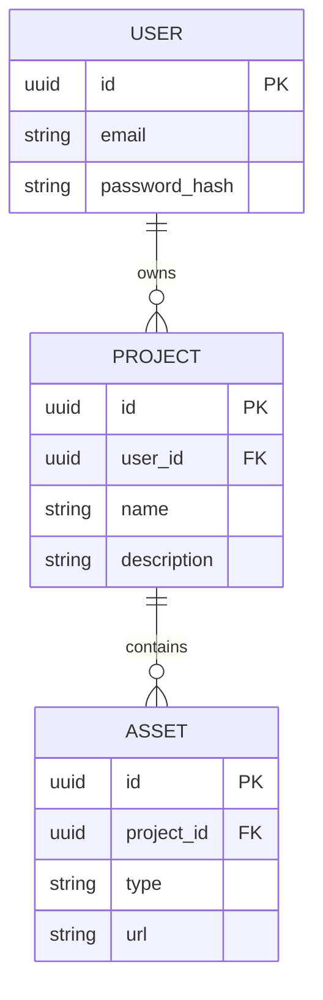

# Normalized Schema Design

## ER Diagram (Mermaid)

## Principles Applied
1. **1:N Relationships**: Users can have multiple projects, and projects can have multiple assets.
2. **Foreign Key Integrity**: `user_id` and `project_id` use `ON DELETE CASCADE` to maintain consistency.
3. **UUIDs**: Primary keys use UUIDs for better distribution and security.
