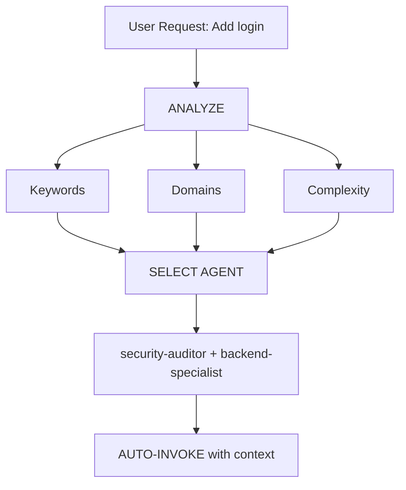

# Intelligent Agent Routing

**Purpose**: Automatically analyze user requests and route them to the most appropriate specialist agent(s) without requiring explicit user mentions.

## Core Principle

> **The AI should act as an intelligent Project Manager**, analyzing each request and automatically selecting the best specialist(s) for the job.

## How It Works

### 1. Request Analysis

Before responding to ANY user request, perform automatic analysis:



### 2. Agent Selection Matrix

**Use this matrix to automatically select agents:**

| User Intent         | Keywords                                                 | Selected Agent(s)                         | Auto-invoke? |
| ------------------- | -------------------------------------------------------- | ----------------------------------------- | ------------ |
| **Authentication**  | "login", "auth", "signup", "password"                    | `security-auditor` + `backend-specialist` | ✅ YES       |
| **UI Component**    | "button", "card", "layout", "style"                      | `frontend-specialist`                     | ✅ YES       |
| **Mobile UI**       | "screen", "navigation", "touch", "gesture"               | `mobile-developer`                        | ✅ YES       |
| **API Endpoint**    | "endpoint", "route", "API", "POST", "GET"                | `backend-specialist`                      | ✅ YES       |
| **Database**        | "schema", "migration", "query", "table"                  | `database-architect` + `backend-specialist` | ✅ YES       |
| **Bug Fix**         | "error", "bug", "not working", "broken"                  | `debugger`                                | ✅ YES       |
| **Test**            | "test", "coverage", "unit", "e2e"                        | `test-engineer`                           | ✅ YES       |
| **Deployment**      | "deploy", "production", "CI/CD", "docker"                | `devops-engineer`                         | ✅ YES       |
| **Kubernetes**      | "kubernetes", "k8s", "helm", "kubectl", "ingress", "rbac", "operator", "hpa", "vpa", "namespace", "pod", "deployment yaml" | `k8s-engineer` | ✅ YES |
| **AI / LLM**        | "llm", "rag", "embedding", "vector db", "prompt", "langchain", "openai", "anthropic sdk", "chatbot", "ai feature", "fine-tune" | `ai-engineer` | ✅ YES |
| **Wiki / Docs**     | "mental model", "wiki", "intuition", "prose-first", "adr", "architecture decision", "documentation drift", "explain why" | `wiki-architect` | ✅ YES |
| **Go (pure)**       | "golang", "go", "grpc", "protobuf", "gin", "echo", "fiber", "xsync", "pprof", "goroutine" | `go-specialist` | ✅ YES |
| **Crypto (pure)**   | "ton", "crypto", "exchange", "trading", "blockchain", "dex", "amm", "jetton", "func", "tact", "mev" | `crypto-specialist` | ✅ YES |
| **Go + Crypto**     | Go signals AND crypto signals together, OR architecture/pipeline/design in crypto-go context | `crypto-go-architect` | ✅ YES |
| **Go Docs**         | "godoc", "go doc", "doc comment", "pkg.go.dev", "doc.go", "go documentation", "document go package" | `go-specialist` | ✅ YES |
| **Security Review** | "security", "vulnerability", "exploit"                   | `security-auditor` + `penetration-tester` | ✅ YES       |
| **Performance**     | "slow", "optimize", "performance", "speed"               | `performance-optimizer`                   | ✅ YES       |
| **Product Def**     | "requirements", "user story", "backlog", "MVP"           | `product-owner`                           | ✅ YES       |
| **E2E / QA**        | "playwright", "cypress", "e2e", "pipeline", "regression" | `qa-automation-engineer`                  | ✅ YES       |
| **Audit**           | "audit", "scan code", "tech debt", "generate tasks"      | `reviewer`                                | ✅ YES       |
| **Cloud Infra**     | "aws", "gcp", "azure", "iam", "vpc", "kms", "s3", "blob" | `cloud-engineer`                          | ✅ YES       |
| **Reliability**     | "slo", "sli", "metrics", "dashboard", "alert", "sre"     | `sre-engineer`                            | ✅ YES       |
| **Release**         | "release", "version", "tag", "changelog", "semver"       | `release-manager`                         | ✅ YES       |
| **Visual Design**   | "design", "color", "typography", "palette", "hsl"        | `visual-designer`                         | ✅ YES       |
| **Product Discovery**| "discovery", "brief", "prd", "architecture", "bmad"      | `analyst`                                 | ✅ YES       |
| **Legacy / Clean**  | "legacy", "refactor", "dead code", "archaeologist"       | `code-archaeologist`                      | ✅ YES       |
| **Data Pipeline**   | "pipeline", "etl", "elt", "dbt", "airflow", "kafka", "clickhouse", "spark", "data warehouse", "data lake" | `data-engineer` | ✅ YES |
| **Git & Merge**     | "git", "conflict", "merge", "rebase", "branch"           | `git-master`                              | ✅ YES       |
| **New Feature**     | "build", "create", "implement", "new app"                | `orchestrator` → multi-agent              | ⚠️ ASK FIRST |
| **Complex Task**    | Multiple domains detected                                | `orchestrator` → multi-agent              | ⚠️ ASK FIRST |

## 4. Response Format

**When auto-selecting an agent, inform the user concisely:**

```markdown
🤖 **Applying knowledge of `@security-auditor` + `@backend-specialist`...**

[Proceed with specialized response]
```

**Benefits:**

- ✅ User sees which expertise is being applied
- ✅ Transparent decision-making
- ✅ Still automatic (no /commands needed)

## Domain Detection Rules

### Single-Domain Tasks (Auto-invoke Single Agent)

| Domain          | Patterns                                       | Agent                   |
| --------------- | ---------------------------------------------- | ----------------------- |
| **Security**    | auth, login, jwt, password, hash, token        | `security-auditor`      |
| **Frontend**    | component, react, vue, css, html, tailwind     | `frontend-specialist`   |
| **Backend**     | api, server, express, fastapi, node            | `backend-specialist`    |
| **Mobile**      | react native, flutter, ios, android, expo      | `mobile-developer`      |
| **Database**    | prisma, sql, mongodb, schema, migration        | `database-architect`    |
| **Testing**     | test, jest, vitest, playwright, cypress        | `test-engineer`         |
| **DevOps**      | docker, ci/cd, pm2, nginx, systemd             | `devops-engineer`       |
| **Kubernetes**  | kubernetes, k8s, helm, kubectl, ingress, rbac, operator, hpa, vpa, namespace | `k8s-engineer` |
| **AI / LLM**    | llm, rag, embedding, vector, prompt, langchain, openai, anthropic, chatbot    | `ai-engineer`  |
| **Wiki / Docs** | mental model, wiki, intuition, adr, prose-first, explain why, documentation  | `wiki-architect` |
| **Debug**       | error, bug, crash, not working, issue          | `debugger`              |
| **Performance** | slow, lag, optimize, cache, performance        | `performance-optimizer` |
| **SEO**         | seo, meta, analytics, sitemap, robots          | `seo-specialist`        |
| **Game**        | unity, godot, phaser, game, multiplayer        | `game-developer`        |
| **E2E / QA**    | playwright, cypress, e2e, regression, pipeline | `qa-automation-engineer` |
| **Audit**       | audit, scan, tech debt, task queue             | `reviewer`              |
| **Data**        | pipeline, etl, elt, dbt, airflow, kafka, spark, clickhouse, data lake | `data-engineer` |
| **Git**         | git, conflict, merge, rebase, reflog, branch, bisect | `git-master`      |
| **Go (pure)**   | golang, go, grpc, protobuf, gin, echo, fiber, xsync, pprof, goroutine | `go-specialist` |
| **Crypto (pure)** | ton, crypto, exchange, trading, blockchain, dex, amm, jetton, func, tact, mev | `crypto-specialist` |
| **Go + Crypto** | Go signals AND crypto signals together, OR architecture/pipeline/design in crypto-go context | `crypto-go-architect` |
| **Go Docs**     | godoc, go doc, doc comment, pkg.go.dev, doc.go, document go | `go-specialist` |

<!-- EMBED_END -->

### 3. Automatic Routing Protocol

Before responding to ANY request, apply TIER 0 analysis:

```javascript
function analyzeRequest(userMessage) {
    const domains = detectDomains(userMessage);
    const complexity = assessComplexity(domains);
    if (complexity === "SIMPLE" && domains.length === 1) {
        return selectSingleAgent(domains[0]);
    } else if (complexity === "MODERATE" && domains.length <= 2) {
        return selectMultipleAgents(domains);
    } else {
        return "orchestrator";
    }
}
```

### Multi-Domain Tasks (Auto-invoke Orchestrator)

If request matches **2+ domains from different categories**, automatically use `orchestrator`:

```text
Example: "Create a secure login system with dark mode UI"
→ Detected: Security + Frontend
→ Auto-invoke: orchestrator
→ Orchestrator will handle: security-auditor, frontend-specialist, test-engineer
```

## Complexity Assessment

### SIMPLE (Direct agent invocation)

- Single file edit
- Clear, specific task
- One domain only
- Example: "Fix the login button style"

**Action**: Auto-invoke respective agent

### MODERATE (2-3 agents)

- 2-3 files affected
- Clear requirements
- 2 domains max
- Example: "Add API endpoint for user profile"

**Action**: Auto-invoke relevant agents sequentially

### COMPLEX (Orchestrator required)

- Multiple files/domains
- Architectural decisions needed
- Unclear requirements
- Example: "Build a social media app"

**Action**: Auto-invoke `orchestrator` → will ask Socratic questions

## Implementation Rules

### Rule 1: Silent Analysis

#### DO NOT announce "I'm analyzing your request..."

- ✅ Analyze silently
- ✅ Inform which agent is being applied
- ❌ Avoid verbose meta-commentary

### Rule 2: Inform Agent Selection

**DO inform which expertise is being applied:**

```markdown
🤖 **Applying knowledge of `@frontend-specialist`...**

I will create the component with the following characteristics:
[Continue with specialized response]
```

### Rule 3: Seamless Experience

**The user should not notice a difference from talking to the right specialist directly.**

### Rule 4: Override Capability

**User can still explicitly mention agents:**

```text
User: "Use @backend-specialist to review this"
→ Override auto-selection
→ Use explicitly mentioned agent
```

## Edge Cases

### Case 1: Generic Question

```text
User: "How does React work?"
→ Type: QUESTION
→ No agent needed
→ Respond directly with explanation
```

### Case 2: Extremely Vague Request

```text
User: "Make it better"
→ Complexity: UNCLEAR
→ Action: Ask clarifying questions first
→ Then route to appropriate agent
```

### Case 3: Contradictory Patterns

```text
User: "Add mobile support to the web app"
→ Conflict: mobile vs web
→ Action: Ask: "Do you want responsive web or native mobile app?"
→ Then route accordingly
```

## Integration with Existing Workflows

### With /orchestrate Command

- **User types `/orchestrate`**: Explicit orchestration mode
- **AI detects complex task**: Auto-invoke orchestrator (same result)

**Difference**: User doesn't need to know the command exists.

### With Socratic Gate

- **Auto-routing does NOT bypass Socratic Gate**
- If task is unclear, still ask questions first
- Then route to appropriate agent

### With CLAUDE.md / GEMINI.md Rules

- **Priority**: CLAUDE.md / GEMINI.md rules > intelligent-routing
- If CLAUDE.md (Claude Code) or GEMINI.md (Antigravity) specifies explicit routing, follow it
- Intelligent routing is the DEFAULT when no explicit rule exists

## Testing the System

### Test Cases

#### Test 1: Simple Frontend Task

```text
User: "Create a dark mode toggle button"
Expected: Auto-invoke frontend-specialist
Verify: Response shows "Using @frontend-specialist"
```

#### Test 2: Security Task

```text
User: "Review the authentication flow for vulnerabilities"
Expected: Auto-invoke security-auditor
Verify: Security-focused analysis
```

#### Test 3: Complex Multi-Domain

```text
User: "Build a chat application with real-time notifications"
Expected: Auto-invoke orchestrator
Verify: Multiple agents coordinated (backend, frontend, test)
```

#### Test 4: Bug Fix

```text
User: "Login is not working, getting 401 error"
Expected: Auto-invoke debugger
Verify: Systematic debugging approach
```

## Performance Considerations

### Token Usage

- Analysis adds ~50-100 tokens per request
- Tradeoff: Better accuracy vs slight overhead
- Overall SAVES tokens by reducing back-and-forth

### Response Time

- Analysis is instant (pattern matching)
- No additional API calls required
- Agent selection happens before first response

## User Education

### Optional: First-Time Explanation

If this is the first interaction in a project:

```markdown
💡 **Tip**: I am configured with automatic specialist agent selection.
I will always choose the most suitable specialist for your task. You can
still mention agents explicitly with `@agent-name` if you prefer.
```

## Debugging Agent Selection

### Enable Debug Mode (for development)

**Antigravity (Gemini):** Add to `GEMINI.md` temporarily.
**Claude Code:** Add to `CLAUDE.md` or `.claude/settings.json` temporarily.

```markdown
## DEBUG: Intelligent Routing

Show selection reasoning:

- Detected domains: [list]
- Selected agent: [name]
- Reasoning: [why]
```

## Regression Guard (MANDATORY for Code-Change Routing)

Any routing decision that results in **code being written or modified** MUST automatically append `test-engineer` as a mandatory final step. This is non-negotiable — code without tests is not done.

### Code-Change Detection

A routing is a **code-change** if the selected agent is any of:
`backend-specialist`, `frontend-specialist`, `go-specialist`, `crypto-specialist`, `crypto-go-architect`, `mobile-developer`,
`database-architect`, `devops-engineer`, `k8s-engineer`, `cloud-engineer`, `ai-engineer`, `data-engineer`, `debugger`, `performance-optimizer`,
`code-archaeologist`, `rest-api-designer`, `grpc-architect`, `game-developer`, `sre-engineer`, `release-manager`, `visual-designer`

### Regression Guard Protocol

```
WHEN routing_agent IN code_change_agents:

  STEP 1 — Capture baseline BEFORE invoking the agent:
    run: go test ./... -race 2>&1 | grep "^ok\|^FAIL" > /tmp/baseline.txt
    (or equivalent for Node.js / Python)

  STEP 2 — Invoke the selected domain agent (implement the change)

  STEP 3 — MANDATORY: invoke test-engineer AFTER domain agent:
    IF no tests exist for modified files:
      → test-engineer writes missing tests FIRST
    THEN test-engineer runs full suite and compares to baseline:
      → Any new FAIL = REGRESSION → domain agent must fix before PR

  STEP 4 — Only after test-engineer confirms green baseline:
    → Proceed to PR creation
```

### No-Tests-Found Rule

```
IF coverage audit shows 0% on modified file:
  → test-engineer must write tests before PR is created
  → "I changed it, it compiles" is NOT done
  → Minimum: happy path + one error path per changed function
```

### Regression Gate Output

After every code-change routing session, test-engineer produces:

```markdown
## Regression Gate Report

### 1. Stash Uncommitted Changes

- `git stash save "Git Master: Pre-op stash"`

### 2. Create Recovery Branch

- `git branch recovery/$(date +%Y%m%d-%H%M%S)`

### 3. Verify Clean Slate

- `git status --short` should be empty (except for stashed items).

**Baseline**: N packages green, M tests passing
**After change**: N packages green, M+K tests passing
**New failures**: 0  ✅ (or list regressions)
**Coverage delta**: pkg/foo: 45% → 72%  ✅
**Race detector**: clean  ✅
**New regression tests**: [list guarded bugs]
```

> 🔴 **A PR that decreases coverage or introduces test failures is BLOCKED until fixed.**

---

## Summary

**intelligent-routing skill enables:**

✅ Zero-command operation (no need for `/orchestrate`)  
✅ Automatic specialist selection based on request analysis  
✅ Transparent communication of which expertise is being applied  
✅ Seamless integration with existing workflows  
✅ Override capability for explicit agent mentions  
✅ Fallback to orchestrator for complex tasks  
✅ **Regression Guard**: test-engineer automatically appended to all code-change routing

**Result**: User gets specialist-level responses without needing to know the system architecture. Every code change is automatically guarded by a regression gate.

---

**Next Steps**:

- **Antigravity (Gemini)**: Integrate this skill into `GEMINI.md` TIER 0 rules.
- **Claude Code**: This skill is loaded by the `orchestrator` agent. No manual integration needed — the orchestrator applies intelligent routing automatically before any agent delegation.

## Changelog

- **1.0.0** (2026-04-26): Initial version
