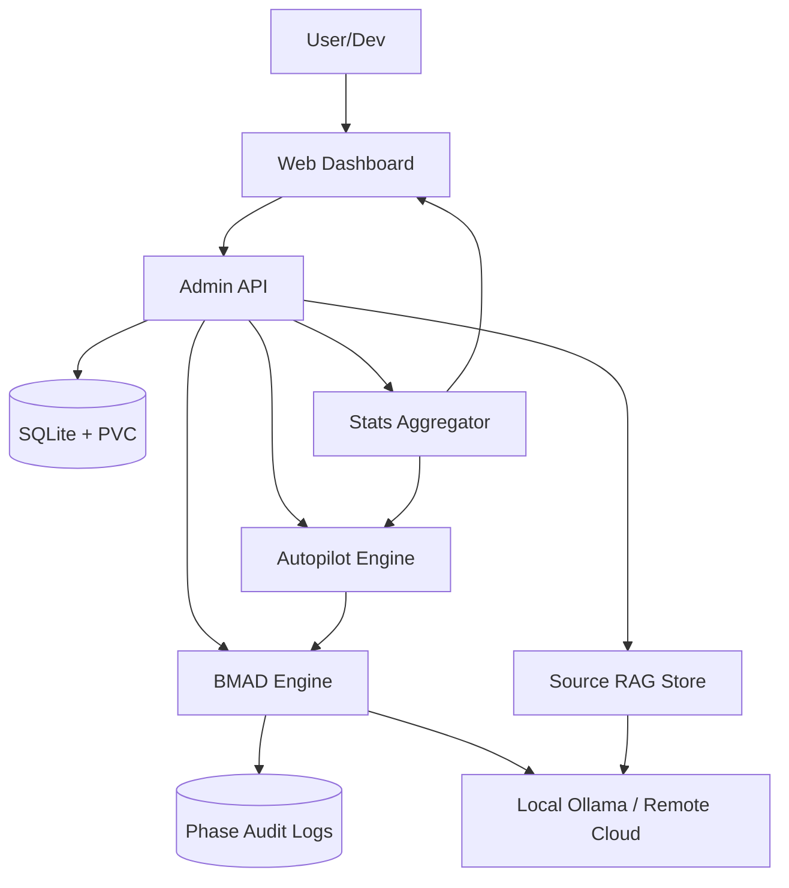

# 🚀 Jules Orchestrator (Pro Max Ultra)

Autonomous, RAG-enhanced agentic platform for the Antigravity Kit with Full CRUD Web UI, Human-in-the-Loop control, and Intelligent LLM Routing.

## 📋 Overview

Jules Orchestrator is a robust Go-based service designed for production-grade agent management. It implements the **BMAD (Discovery-Planning-Execution-Verification)** methodology for local tasks, integrates **Source-Aware RAG** for deep repository understanding, and provides **Human-in-the-Loop (HITL)** safety rails.

### Key Features

- **BMAD 4-Phase Pipeline**: Every task follows a structured lifecycle: Analysis → Planning → Execution → Verification. Each phase has independent retry logic and latency tracking.
- **Autopilot Engine (Dynamic Scaling)**: Intelligent resource manager that monitors repository `tasks/` folders. It automatically activates workers when backlog exists and pauses them when empty to save LLM context and costs.
- **DTO Auto-Sync (Hot Reload)**: Background worker that pulls fresh agent templates from Git every hour and reloads them into the system without downtime.
- **Source-Aware RAG**: Automatically indexes repository source code (.go, .js, .py, etc.) to provide agents with accurate project context. Includes guardrails (file size/count limits) for performance.
- **Human-in-the-Loop (HITL)**: Optional "Approval Mode" pauses the agent after the planning phase, allowing users to review and edit the execution plan before any changes are made.
- **Real-time Live Tracking**: Terminal-style "Inspect" view with live streaming of phase output and real-time dashboard Sparklines for CPU/RAM/Load monitoring.
- **Intelligent Hybrid LLM Routing**: Automatically classifies tasks. SIMPLE tasks run on local Ollama (phi3/mistral), while COMPLEX tasks route to cloud models (Claude 3.5/GPT-4o).
- **Persistent Chat History**: Maintains context across sessions, allowing agents to remember past decisions and user feedback.
- **Autonomous Supervision**: Detects stuck agents and provides automated "supervisor" responses to ensure continuous progress.

## 🛠️ Architecture



## 🚀 Quick Start

### Prerequisites

- **Go 1.25+**
- **Ollama** (for local agentic tasks)
- **SQLite 3**
- **Antigravity Agent Context** (`.agent` directory in target repos)

### Installation & Run

```bash
# Build the orchestrator
go build -o orchestrator ./cmd/orchestrator/main.go

# Start with default settings
./orchestrator
```

## ⚙️ Configuration

### Environment Variables

| Variable | Description | Default |
| :--- | :--- | :--- |
| `LLM_LOCAL_ENDPOINT` | URL for Ollama | `http://localhost:11434` |
| `LLM_REMOTE_ENDPOINT` | URL for Cloud LLM (OpenAI compatible) | - |
| `LLM_REMOTE_API_KEY` | API Key for Cloud LLM | - |
| `LLM_LOCAL_MODEL` | Model for local tasks | `phi3:mini` |
| `LLM_REMOTE_MODEL` | Model for complex tasks | `gpt-4o` |
| `CLEANUP_SCHEDULE` | Cron schedule for DB cleanup | `0 2 * * *` |
| `DB_PATH` | Path to SQLite database | `/app/data/tasks.db` |
| `PROMPT_LIBRARY_CACHE_DIR`| Cache for agent prompts | `./data/prompt-lib` |

### Indexer Guardrails (Hardcoded)
- **Max Files**: 500 per repository.
- **Max File Size**: 100 KB (to optimize LLM context).
- **Ignore List**: `.git`, `node_modules`, `vendor`, `dist`, `build`.

## 🧪 Testing

```bash
# Run all tests (including new guardrail checks)
go test -v ./...
```

---
> Part of the **Antigravity Kit** for automated agentic coding.
