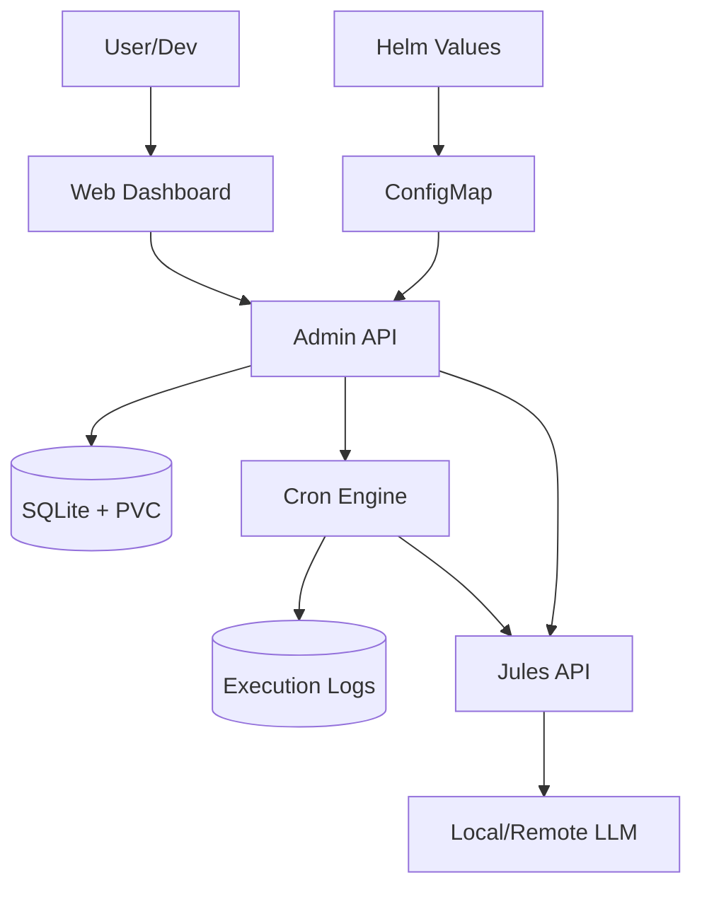

# 🚀 Jules Orchestrator (Pro Max Edition)

Autonomous, stateful agent manager for the Antigravity Kit with Full CRUD Web UI and Intelligent LLM Routing.

## 📋 Overview

Jules Orchestrator is a robust Go-based service designed to run in Kubernetes. It manages the lifecycle of AI agent sessions (Jules), handles complex task scheduling via SQLite persistence, and provides a premium Web Management Interface for real-time control and auditing.

### Key Features

- **Intelligent Hybrid LLM Routing**: Automatically classifies tasks as `SIMPLE` or `COMPLEX`. SIMPLE tasks are handled by local models (Ollama), while COMPLEX tasks are routed to high-reasoning cloud models (Claude 3.5/OpenAI).
- **Autonomous Agent Supervision**: Detects when agents are stuck (e.g., `WAITING_FOR_USER`) and uses an internal LLM to provide automated "supervisor" responses, ensuring continuous progress.
- **Full CRUD Web UI**: Modern glassmorphism dashboard to create, edit, pause, and delete agentic tasks, plus a dedicated Settings panel for LLM and Telegram.
- **Execution Audit Logs**: Detailed "In/Out" logging for every task run, capturing exact prompts sent to the LLM and the raw responses received.
- **Centralized Helm Management**: Default task schedules are managed in `values.yaml` and synchronized automatically on startup, while allowing runtime overrides.
- **Autonomous Scheduling**: Internal cron engine triggers tasks from SQLite with persistent state across pod restarts.

## 🛠️ Architecture



## 🚀 Quick Start

### Prerequisites

- **Go 1.25+** (for local development)
- **Kubernetes** cluster with Helm installed
- **Ollama** (for local LLM tasks) or **OpenAI/Anthropic API Key**
- `JULES_API_KEY` for agent session management

### Deployment (Helm)

The orchestrator is deployed using the `go-agent-llm-orchestrator` chart.

```bash
# Update schedule in values.yaml
helm upgrade --install jules ./charts/go-agent-llm-orchestrator
```

### Accessing the Dashboard

By default, the dashboard is available via Ingress at `http://jules.lab.me/dashboard`.

## ⚙️ Configuration

### Environment Variables

| Variable | Description | Default |
| :--- | :--- | :--- |
| `LLM_LOCAL_ENDPOINT` | URL for local LLM (e.g., Ollama) | `http://ollama:11434` |
| `LLM_REMOTE_ENDPOINT` | URL for remote LLM provider (OpenAI compatible) | - |
| `LLM_REMOTE_API_KEY` | API Key for remote LLM | - |
| `LLM_LOCAL_MODEL` | Default model for local tasks | `phi3:mini` |
| `LLM_REMOTE_MODEL` | Default model for complex tasks | `gpt-4o` |
| `JULES_API_KEY` | API key for Jules session management | - |
| `DB_PATH` | Path to SQLite database file | `/app/data/tasks.db` |
| `ADMIN_ADDR` | Listening address for Web UI & API | `:8080` |

### Runtime Settings

Settings like specific models and Telegram bot tokens can be updated directly via the **Settings** modal in the Web UI, which persist in the `settings` table of the database.

## 🧪 Testing

```bash
go test -v ./...
```

---
> Part of the **Antigravity Kit** for automated agentic coding.
