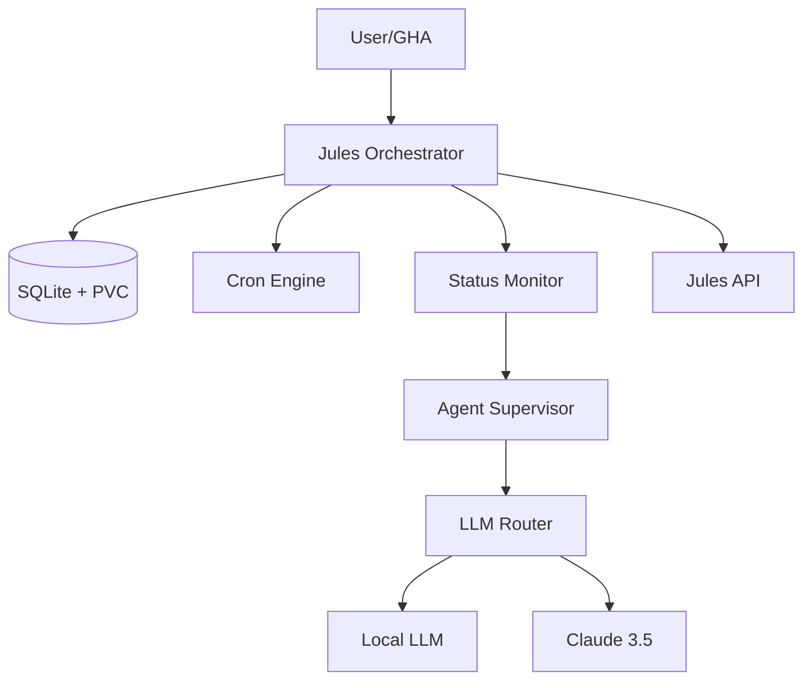

# 🚀 Jules Orchestrator (K8s Edition)

Autonomous, stateful agent manager for the Antigravity Kit.

## 📋 Overview

Jules Orchestrator is a robust Go-based service designed to run in Kubernetes. It manages the lifecycle of AI agent sessions (Jules), handles complex task scheduling via SQLite persistence, and provides intelligent "Supervision" to resolve blocked sessions automatically.

### Key Features
- **Autonomous Scheduling**: Internal cron engine triggers tasks from SQLite.
- **Intelligent LLM Routing**: Automatically routes tasks between local models (Ollama) and cloud models (Claude) based on complexity.
- **Agent Supervision**: Detects `WAITING_FOR_USER` blocks and provides automated responses to keep agents moving.
- **Traffic Management**: Respects Jules API rate limits with a priority-aware queuing system.
- **K8s Native**: Designed for Kubernetes with multi-stage Docker builds and PVC support.

## 🛠️ Architecture



## 🚀 Quick Start

### Prerequisites
- Go 1.25+
- Kubernetes cluster (or Minikube/Docker Desktop)
- `JULES_API_KEY` and `LLM_API_KEY`

### Local Development
```bash
# Setup environment
export DB_PATH="./data/tasks.db"
export LLM_ENDPOINT="http://localhost:11434"
export LLM_MODEL="llama3"

# Run the orchestrator
go run cmd/orchestrator/main.go
```

### Kubernetes Deployment
1. **Apply PVC and Secrets**:
   ```bash
   kubectl apply -f k8s/pvc.yaml
   # Edit secret.yaml with your keys first
   kubectl apply -f k8s/secret.yaml
   ```
2. **Deploy**:
   ```bash
   kubectl apply -f k8s/deployment.yaml
   ```

## ⚙️ Configuration

| Variable | Description | Default |
|----------|-------------|---------|
| `JULES_API_KEY` | API key for Jules | - |
| `LLM_API_KEY` | API key for LLM provider | - |
| `LLM_ENDPOINT` | URL for OpenAI-compatible LLM API | - |
| `LLM_MODEL` | Model name for classification/supervision | `llama3` |
| `DB_PATH` | Path to SQLite database file | `/app/data/tasks.db` |

## 🧪 Testing
```bash
go test -v ./...
```

---
> Part of the **Antigravity Kit** for automated agentic coding.
