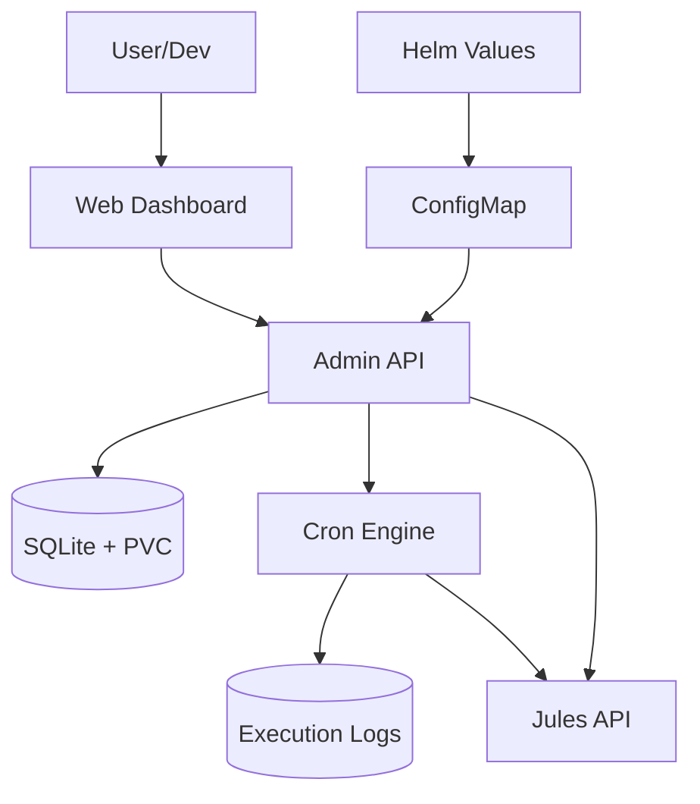

# 🚀 Jules Orchestrator (Pro Max Edition)

Autonomous, stateful agent manager for the Antigravity Kit with Full CRUD Web UI.

## 📋 Overview

Jules Orchestrator is a robust Go-based service designed to run in Kubernetes. It manages the lifecycle of AI agent sessions (Jules), handles complex task scheduling via SQLite persistence, and provides a premium Web Management Interface for real-time control and auditing.

### Key Features

- **Centralized Helm Management**: Task schedules are managed directly in `values.yaml` and synchronized automatically on startup.
- **Full CRUD Web UI**: Modern glassmorphism dashboard to create, edit, pause, and delete agentic tasks.
- **Execution Audit Logs**: Detailed "In/Out" logging for every task run, capturing prompts sent and responses received.
- **Autonomous Scheduling**: Internal cron engine triggers tasks from SQLite with persistent state.
- **Intelligent LLM Routing**: Automatically routes tasks between local models (Ollama) and cloud models based on complexity.
- **Agent Supervision**: Detects `WAITING_FOR_USER` blocks and uses an internal LLM to provide automated responses, ensuring zero-downtime autonomy.
- **Prompt-Driven Tasks**: The `mission` field in task definitions acts as the primary LLM prompt sent to the agent.

## 🛠️ Architecture



## 🚀 Quick Start

### Prerequisites

- Go 1.25+ (for local development)
- Kubernetes cluster with Helm
- `JULES_API_KEY` and Ollama/OpenAI endpoint

### Deployment (Helm)

The orchestrator is now part of the central `RecipientOFQuotes-Charts` repository.

```bash
# Update schedule in values.yaml
helm upgrade --install jules ./charts/go-agent-llm-orchestrator
```

### Accessing the Dashboard

By default, the dashboard is available via Ingress at `http://jules.lab.me/dashboard`.

## ⚙️ Configuration

| Variable | Description | Default |
| :--- | :--- | :--- |
| `DISTRIBUTION_CONFIG_PATH` | Path to the YAML file with default task schedule | `/app/config/distribution.yml` |
| `DB_PATH` | Path to SQLite database file | `/app/data/tasks.db` |
| `JULES_API_KEY` | API key for Jules | - |
| `ADMIN_ADDR` | Listening address for Web UI & API | `:8080` |

## 🧪 Testing

```bash
go test -v ./...
```

---
> Part of the **Antigravity Kit** for automated agentic coding.
