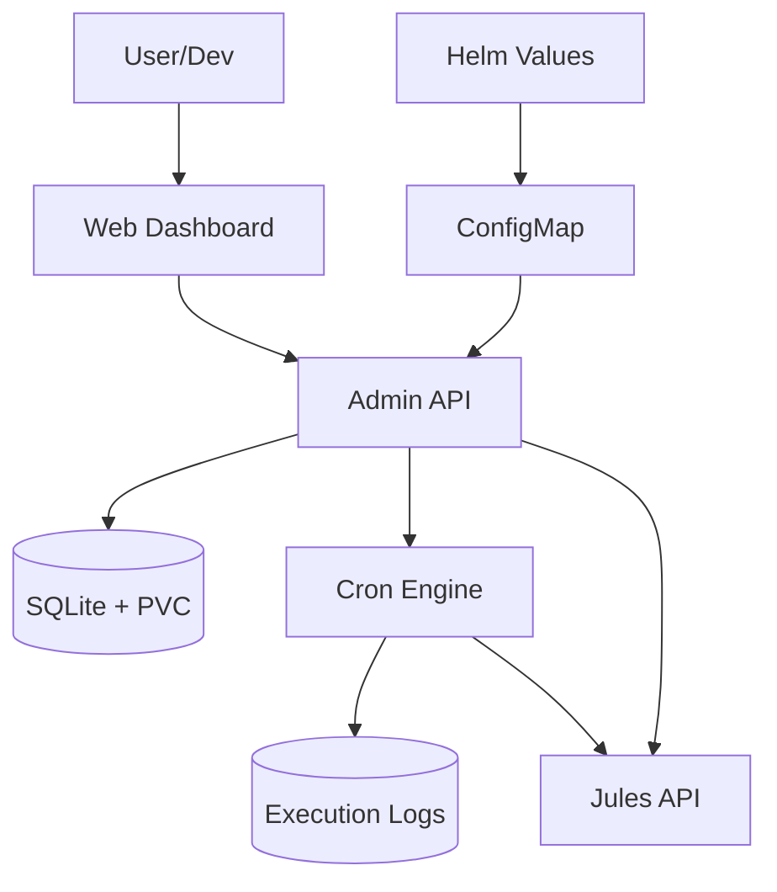

# Architecture: Jules Orchestrator (Pro Max Edition)

> Version: 1.0 | Status: FINAL | Linked PRD: wiki/PRD.md | Date: 2026-04-22

---

## 1. System Context

The Jules Orchestrator is a standalone Go application running in Kubernetes. It sits between the user's task definitions and the Jules API, providing a layer of persistence, intelligence, and autonomous management via a premium Web UI.



## 2. Components

| Component | Responsibility | Technology | Package/Path |
| :--- | :--- | :--- | :--- |
| **Admin API** | REST API for task management (CRUD) and log retrieval. | Go (Standard Net/HTTP) | `internal/api` |
| **Web UI** | Premium management dashboard (Glassmorphism). | HTML/CSS/JS (Vanilla) | `web/static` |
| **Scheduler** | Watches task schedules and triggers executions. | Go (robfig/cron) | `internal/scheduler` |
| **Log Recorder** | Captures "In/Out" payloads for every task execution. | Go / SQL | `internal/scheduler` |
| **LLM Router** | Classifies tasks and generates auto-responses for blocked sessions. | Go (LangChain-Go style) | `internal/llm` |
| **Storage Engine** | Manages persistent task, session, and audit data. | SQLite3 (modernc.org/sqlite) | `internal/db` |

## 3. Data Flow

1. **Boot Sync (Cold Start)**: `main.go` reads `/app/config/distribution.yml` (mounted from K8s ConfigMap) → Calls `engine.ImportDistribution()` → UPSERTs tasks into SQLite.
2. **Management**: User edits/adds tasks via Web UI → `Admin API` updates SQLite → Triggers `engine.SyncTasks()` to update cron schedule in-memory.
3. **Execution**: Scheduler triggers task → Captures "In" payload → Calls Jules API → Captures "Out" payload.
4. **Auditing**: `Log Recorder` writes execution results, payloads, and duration to `task_logs`.
5. **Supervision**: `internal/monitor` polls Jules API → If blocked, `internal/llm` generates response → Calls Jules API to resume.

## 4. Architecture Decision Records (ADRs)

### ADR-001: SQLite for State Management

- **Status:** Accepted
- **Decision:** Use SQLite3 stored on a K8s Persistent Volume (PVC).

### ADR-004: Centralized Helm-First Configuration

- **Status:** Accepted
- **Context:** Multiple environments (dev/prod) require different default task schedules.
- **Decision:** Store the master task schedule in Helm `values.yaml`, mount it via ConfigMap, and reconcile SQLite on every boot.
- **Consequences:** Single source of truth in Git (Charts), but allows runtime overrides via Web UI.

### ADR-005: Detailed In/Out Execution Logging

- **Status:** Accepted
- **Context:** Debugging autonomous agent failures is difficult without seeing exactly what they were asked and what they did.
- **Decision:** Record the full request/response payload for every Jules session in a dedicated `task_logs` table.

## 5. Database Schema

```sql
CREATE TABLE tasks (
    id TEXT PRIMARY KEY,
    name TEXT NOT NULL,
    mission TEXT,
    pattern TEXT,
    schedule TEXT NOT NULL,
    status TEXT NOT NULL,
    last_run_at DATETIME,
    created_at DATETIME DEFAULT CURRENT_TIMESTAMP
);

CREATE TABLE task_logs (
    id INTEGER PRIMARY KEY AUTOINCREMENT,
    task_id TEXT NOT NULL REFERENCES tasks(id) ON DELETE CASCADE,
    executed_at DATETIME DEFAULT CURRENT_TIMESTAMP,
    input_data TEXT,
    output_data TEXT,
    status TEXT,
    error TEXT,
    duration_ms INTEGER
);
```

## 6. Deployment Strategy

The orchestrator is deployed via Helm from the `RecipientOFQuotes-Charts` repository.

- **Storage**: Requires `PersistentVolumeClaim` (ReadWriteOnce) for SQLite.
- **Ingress**: Exposed via NGINX Ingress Controller with long timeouts (3600s) for LLM sessions.

## 7. Approval

- [x] Architecture reviewed
- [x] All ADRs accepted
- [x] Security considerations addressed
- [x] **APPROVED for Release Pro Max** — Date: 2026-04-22
