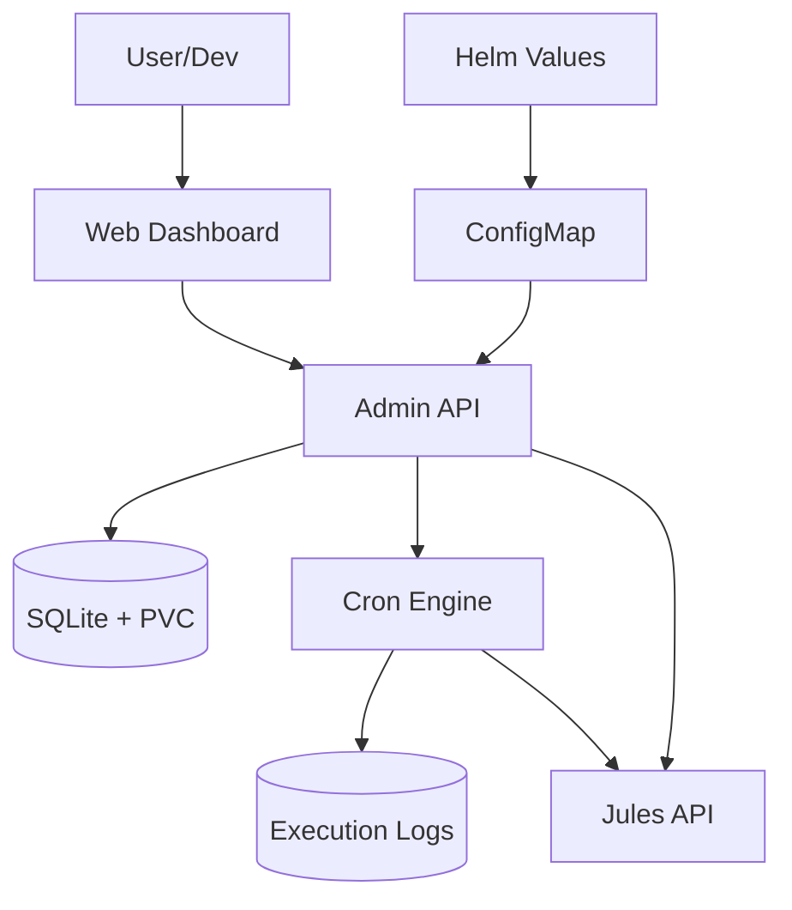

# Architecture: Jules Orchestrator (Pro Max Edition)

> Version: 1.0 | Status: FINAL | Linked PRD: wiki/PRD.md | Date: 2026-04-22

---

## 1. System Context

The Jules Orchestrator is a standalone Go application running in Kubernetes. It sits between the user's task definitions and the Jules API, providing a layer of persistence, intelligence, and autonomous management via a premium Web UI.



## 2. Components

| Component | Responsibility | Technology | Package/Path |
| :--- | :--- | :--- | :--- |
| **Admin API** | REST API for task management (CRUD) and log retrieval. | Go (Standard Net/HTTP) | `internal/api` |
| **Web UI** | Premium management dashboard (Glassmorphism). | HTML/CSS/JS (Vanilla) | `web/static` |
| **Scheduler** | Watches task schedules and triggers executions. | Go (robfig/cron) | `internal/scheduler` |
| **Autopilot** | Monitors backlogs and scales workers dynamically. | Go | `internal/autopilot` |
| **DTO/RAG** | Repository analysis and code search indexing. | Go (chromem-go) | `internal/dto`, `internal/rag` |
| **Traffic Manager** | Priority-based LLM request queuing. | Go | `internal/traffic` |
| **Monitor** | Polls Jules API for status updates and triggers supervisor. | Go | `internal/monitor` |
| **Supervisor** | Generates automated responses for blocked agent sessions. | Go | `internal/llm` |
| **Storage Engine** | Manages persistent data in SQLite (Main & History). | SQLite3 | `internal/db` |
| **Git Syncer** | Keeps local repos and prompt-library in sync. | Go (go-git) | `internal/git` |

## 3. Data Flow

1. **Boot Sync**: `main.go` reads `distribution.yml` → UPSERTs tasks into SQLite.
2. **Repository Sync**: `internal/git` pulls/clones managed repositories and the `prompt-library`.
3. **DTO Indexing**: `internal/dto` pre-scans repositories and generates embeddings for the RAG store.
4. **Autopilot Loop**: `internal/autopilot` checks `tasks/` in local repos → Activates workers if backlog > 0.
5. **Execution**: Scheduler triggers task → `internal/traffic` queues request → Calls Jules API with RAG context.
6. **Monitoring (Event-Driven)**: Jules API pushes Webhooks to `/api/v1/webhooks/jules` → Updates SQLite and pushes to UI via WebSocket Hub.
7. **Supervision**: If session transitions to `AWAITING_USER_FEEDBACK`, `internal/llm` immediately generates response via Supervisor.
8. **Cleanup**: Background job in `internal/scheduler` deletes old logs/sessions.

## 4. Architecture Decision Records (ADRs)

### ADR-001: SQLite for State Management

- **Status:** Accepted
- **Decision:** Use SQLite3 on PVC. Split into `main.db` (config) and `history.db` (logs) for performance.

### ADR-006: Dedicated Status Monitor

- **Status:** Deprecated (Superseded by ADR-007)
- **Decision:** Use a separate background poller to sync Jules API statuses into local SQLite, decoupling execution from monitoring.

### ADR-007: Event-Driven Webhook Sync

- **Status:** Accepted
- **Decision:** Transition from API polling to Webhooks/SSE. Orchestrator provides a secure endpoint `POST /api/v1/webhooks/jules` to receive real-time session status updates from Jules API.
- **Payload Schema:** 
  ```json
  {
    "event": "session.updated",
    "session_id": "sess_123",
    "task_id": "task_456",
    "status": "AWAITING_USER_FEEDBACK",
    "timestamp": "2026-04-27T10:00:00Z"
  }
  ```

## 5. Database Schema

### Main Database (`main.db`)

```sql
CREATE TABLE tasks (
    id TEXT PRIMARY KEY,
    name TEXT NOT NULL,
    agent TEXT DEFAULT '',
    mission TEXT,
    pattern TEXT,
    schedule TEXT NOT NULL,
    status TEXT NOT NULL,
    current_stage TEXT DEFAULT 'idle',
    progress INTEGER DEFAULT 0,
    last_run_at DATETIME,
    approval_required INTEGER DEFAULT 0,
    pending_decision TEXT DEFAULT '',
    failure_count INTEGER DEFAULT 0,
    importance INTEGER DEFAULT 1,
    category TEXT DEFAULT 'worker',
    auto_paused INTEGER DEFAULT 0,
    created_at DATETIME DEFAULT CURRENT_TIMESTAMP
);

CREATE TABLE sessions (
    id TEXT PRIMARY KEY,
    task_id TEXT,
    jules_session_id TEXT UNIQUE,
    status TEXT NOT NULL,
    last_context_hash TEXT,
    updated_at DATETIME DEFAULT CURRENT_TIMESTAMP
);

CREATE TABLE settings (
    key TEXT PRIMARY KEY,
    value TEXT
);

CREATE TABLE templates (
    name TEXT PRIMARY KEY,
    content TEXT NOT NULL,
    updated_at DATETIME DEFAULT CURRENT_TIMESTAMP
);
```

### History Database (`history.db`)

```sql
CREATE TABLE task_logs (
    id INTEGER PRIMARY KEY AUTOINCREMENT,
    task_id TEXT NOT NULL,
    session_id TEXT,
    executed_at DATETIME DEFAULT CURRENT_TIMESTAMP,
    input_data TEXT,
    output_data TEXT,
    status TEXT,
    error TEXT,
    duration_ms INTEGER
);

CREATE TABLE web_chat_history (
    id INTEGER PRIMARY KEY AUTOINCREMENT,
    role TEXT NOT NULL,
    content TEXT NOT NULL,
    provider TEXT,
    repo TEXT,
    created_at DATETIME DEFAULT CURRENT_TIMESTAMP
);
```

## 6. Deployment Strategy

The orchestrator is deployed via Helm from the `RecipientOFQuotes-Charts` repository.

- **Storage**: Requires `PersistentVolumeClaim` (ReadWriteOnce) for SQLite.
- **Ingress**: Exposed via NGINX Ingress Controller with long timeouts (3600s) for LLM sessions.

## 7. Approval

- [x] Architecture reviewed
- [x] All ADRs accepted
- [x] Security considerations addressed
- [x] **APPROVED for Release Pro Max** — Date: 2026-04-22
