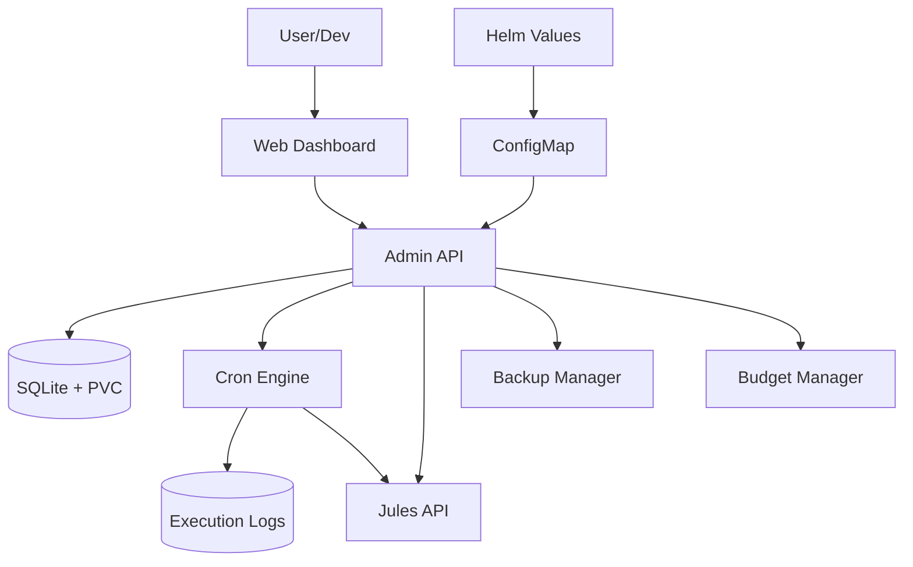

# Architecture: Jules Orchestrator (Pro Max Edition)

> Version: 1.0 | Status: FINAL | Linked PRD: wiki/PRD.md | Date: 2026-04-22

---

## 1. System Context

The Jules Orchestrator is a standalone Go application running in Kubernetes. It sits between the user's task definitions and the Jules API, providing a layer of persistence, intelligence, and autonomous management via a premium Web UI.



## 2. Components

| Component | Responsibility | Technology | Package/Path |
| :--- | :--- | :--- | :--- |
| **Admin API** | REST API for task management (CRUD) and log retrieval. | Go (Standard Net/HTTP) | `internal/api` |
| **Web UI** | Premium management dashboard (Glassmorphism). | HTML/CSS/JS (Vanilla) | `web/static` |
| **Scheduler** | Watches task schedules and triggers executions. | Go (robfig/cron) | `internal/scheduler` |
| **Autopilot** | Monitors backlogs and scales workers dynamically. | Go | `internal/autopilot` |
| **DTO/RAG** | Repository analysis and code search indexing. Features persistence via chromem-go, self-healing corruption recovery, and Ollama priority gating. | Go (chromem-go) | `internal/dto`, `internal/rag` |
| **Traffic Manager** | Priority-based LLM request queuing and observability. | Go | `internal/traffic` |
| **Monitor** | Polls Jules API, triggers supervisor, and detects Doc-Drift. | Go | `internal/monitor` |
| **Supervisor** | Generates automated responses for blocked agent sessions. | Go | `internal/llm` |
| **Budget Manager** | Enforces cost and session limits across tasks. | Go | `internal/budget` |
| **Storage Engine** | Manages persistent data in SQLite (Main & History). | SQLite3 | `internal/db` |
| **Git Syncer** | Keeps local repos and prompt-library in sync. | Go (go-git) | `internal/git` |
| **Backup Manager** | Password-protected ZIP export/import of system state. | Go | `internal/backup` |

## 3. Key Source Files

- **API Entry**: `internal/api/server.go`
- **Backup Engine**: `internal/backup/manager.go`
- **Database Engine**: `internal/db/sqlite.go`
- **Git Synchronizer**: `internal/git/syncer.go`
- **Task Scheduler**: `internal/scheduler/cron.go`
- **Main Entry**: `cmd/orchestrator/main.go`
- **RAG Storage**: `internal/rag/store.go`
- **Frontend App**: `web/static/js/app.js`

## 4. Data Flow

1. **Boot Sync**: `main.go` reads `distribution.yml` → UPSERTs tasks into SQLite.
2. **Repository Sync**: `internal/git` pulls/clones managed repositories and the `prompt-library`.
3. **DTO Indexing**: `internal/dto` pre-scans repositories and generates embeddings for the RAG store.
4. **Autopilot Loop**: `internal/autopilot` checks `tasks/` in local repos → Activates workers if backlog > 0.
5. **Execution**: Scheduler triggers task → `internal/traffic` queues request → Calls Jules API with RAG context.
6. **Monitoring (Event-Driven)**: Jules API pushes Webhooks to `/api/v1/webhooks/jules` → Updates SQLite and pushes to UI via WebSocket Hub.
7. **Supervision**: If session transitions to `AWAITING_USER_FEEDBACK`, `internal/llm` immediately generates response via Supervisor.
| 8. **Cleanup**: Background job in `internal/scheduler` deletes old logs/sessions.
9. **RAG Self-Healing**: Monitor indices for corruption (e.g., magic number mismatch) and trigger automated recovery/re-indexing if necessary.
10. **Priority Gating**: `rag.MemoryStore` uses a global mutex (`inferMu`) shared with the LLM Router to prevent concurrent embedding/inference overload on Ollama.

## 4. Architecture Decision Records (ADRs)

### ADR-001: SQLite for State Management

- **Status:** Accepted
- **Decision:** Use SQLite3 on PVC. Split into `main.db` (config) and `history.db` (logs) for performance.

### ADR-006: Dedicated Status Monitor

- **Status:** Deprecated (Superseded by ADR-007)
- **Decision:** Use a separate background poller to sync Jules API statuses into local SQLite, decoupling execution from monitoring.

### ADR-007: Event-Driven Webhook Sync

- **Status:** Accepted
- **Decision:** Transition from API polling to Webhooks/SSE. Orchestrator provides a secure endpoint `POST /api/v1/webhooks/jules` to receive real-time session status updates from Jules API.
- **Payload Schema:**

  ```json
  {
    "event": "session.updated",
    "session_id": "sess_123",
    "task_id": "task_456",
    "status": "AWAITING_USER_FEEDBACK",
    "timestamp": "2026-04-27T10:00:00Z"
  }
  ```

### ADR-008: Governance & Budgets

- **Status:** Accepted
- **Decision:** Implement a centralized `BudgetManager` to enforce daily session limits and monthly cost quotas. Limits are stored in the `budgets` table and checked by `TrafficManager` before task execution.

### ADR-009: Command Center Transparency

- **Status:** Accepted
- **Decision:** Expose internal states (audit logs, traffic queues, drift status) directly to the Web UI via new API endpoints to reduce operational "blind spots" in autonomous mode.

### ADR-010: Backup & Restore System

- **Status:** Accepted
- **Decision:** Implement a password-protected ZIP backup system that snapshots SQLite databases and includes repositories, RAG indices, and prompt libraries. Use `github.com/alexmullins/zip` for AES-256 encryption. To ensure reliability in Kubernetes, temporary snapshots are stored in the application's persistent data directory (`dataDir`).

### ADR-011: RAG Priority Gating & Self-Healing

- **Status:** Accepted
- **Decision:** Implement a priority gate (`sync.RWMutex`) in the RAG store to synchronize vector embeddings with active LLM inference. Add a "Recovery" mode that detects index corruption (magic number errors) and re-initializes storage from scratch to prevent system crashes.

### ADR-012: Real-time UI synchronization via Unified State Store

- **Status:** Accepted
- **Decision:** Establish a single source of truth for task and RAG metrics on the frontend. Use a global `Store` object in `app.js` and event-driven WebSocket updates (`agent_trace`, `dto_ready`, `rag_progress`) to eliminate "two clocks" UI drift between different dashboard tabs.

## 5. Database Schema

### Main Database (`main.db`)

```sql
CREATE TABLE tasks (
    id TEXT PRIMARY KEY,
    name TEXT NOT NULL,
    agent TEXT DEFAULT '',
    mission TEXT,
    pattern TEXT,
    schedule TEXT NOT NULL,
    status TEXT NOT NULL,
    current_stage TEXT DEFAULT 'idle',
    progress INTEGER DEFAULT 0,
    last_run_at DATETIME,
    approval_required INTEGER DEFAULT 0,
    pending_decision TEXT DEFAULT '',
    failure_count INTEGER DEFAULT 0,
    importance INTEGER DEFAULT 1,
    category TEXT DEFAULT 'worker',
    auto_paused INTEGER DEFAULT 0,
    created_at DATETIME DEFAULT CURRENT_TIMESTAMP
);

CREATE TABLE sessions (
    id TEXT PRIMARY KEY,
    task_id TEXT,
    jules_session_id TEXT UNIQUE,
    status TEXT NOT NULL,
    last_context_hash TEXT,
    updated_at DATETIME DEFAULT CURRENT_TIMESTAMP
);

CREATE TABLE settings (
    key TEXT PRIMARY KEY,
    value TEXT
);

CREATE TABLE templates (
    name TEXT PRIMARY KEY,
    content TEXT NOT NULL,
    updated_at DATETIME DEFAULT CURRENT_TIMESTAMP
);
```

### History Database (`history.db`)

```sql
CREATE TABLE task_logs (
    id INTEGER PRIMARY KEY AUTOINCREMENT,
    task_id TEXT NOT NULL,
    session_id TEXT,
    executed_at DATETIME DEFAULT CURRENT_TIMESTAMP,
    input_data TEXT,
    output_data TEXT,
    status TEXT,
    error TEXT,
    duration_ms INTEGER
);

CREATE TABLE audit_logs (
    id INTEGER PRIMARY KEY AUTOINCREMENT,
    session_id TEXT,
    action TEXT,
    details TEXT,
    created_at DATETIME DEFAULT CURRENT_TIMESTAMP
);

CREATE TABLE budgets (
    id INTEGER PRIMARY KEY AUTOINCREMENT,
    target_type TEXT NOT NULL, -- "system", "project"
    target_id TEXT,           -- repo name
    daily_session_limit INTEGER,
    monthly_cost_limit REAL,
    alert_threshold REAL,
    created_at DATETIME DEFAULT CURRENT_TIMESTAMP
);

CREATE TABLE web_chat_history (
    id INTEGER PRIMARY KEY AUTOINCREMENT,
    role TEXT NOT NULL,
    content TEXT NOT NULL,
    provider TEXT,
    repo TEXT,
    created_at DATETIME DEFAULT CURRENT_TIMESTAMP
);
```

## 6. Deployment Strategy

The orchestrator is deployed via Helm from the `RecipientOFQuotes-Charts` repository.

- **Storage**: Requires `PersistentVolumeClaim` (ReadWriteOnce) for SQLite.
- **Ingress**: Exposed via NGINX Ingress Controller with long timeouts (3600s) for LLM sessions.

## 7. Approval

- [x] Architecture reviewed
- [x] All ADRs accepted
- [x] Security considerations addressed
- [x] **APPROVED for Release Pro Max** — Date: 2026-04-22
